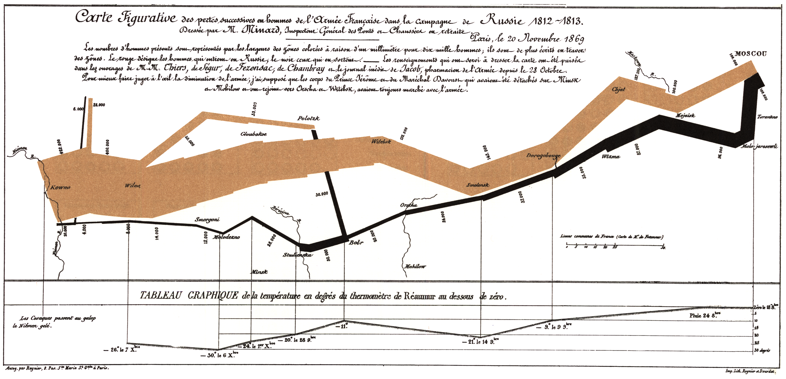

# Introduction to Probability and Statistics

## Week 1

### Monday

No class

### Wednesday

No class

### Thursday Lab

Intro to R (due next Monday 11:59 pm)

### Friday

- Notes on the lab
- Course Logistics
- Data Collection for Inference

**For next time**
- Join slack group/channel and count off
- Read p. 1 - 16
- Work on Lab, Problem Set
