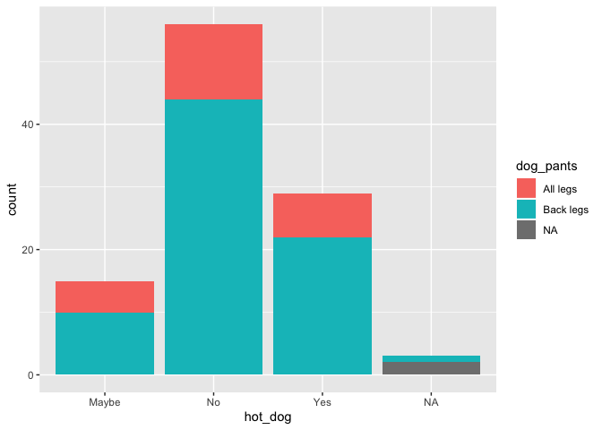
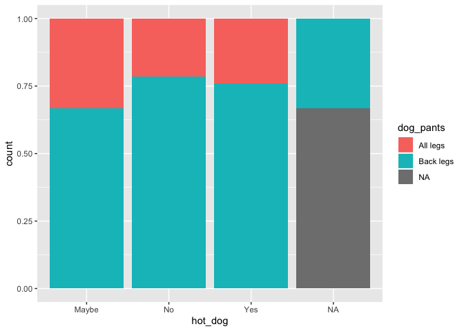
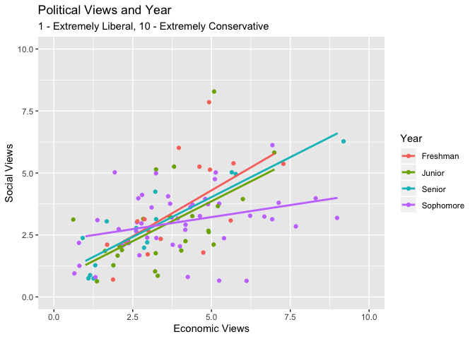

Lab 3: Data Visualization
================

## Setup

This lab will focus on generating plots using the `ggplot2` package, as
well as practicing data subsetting with the `filter()` command from the
`dplyr` package. To get started, load the following packages and data
set.

``` r
library(dplyr)
library(ggplot2)
library(oilabs)
data(survey141)
```

This data comes from a class survey that Math 141 students took two
years ago, however the data frame we’ll be using has been slightly
altered to make generating plots easier. The column names of the data
set have been changed as well. The help file contains the original
questions.

``` r
?survey141
```

## Plot Types

The `ggplot` command is used to create a base layer for a plot, with
`aes()` used to specify which visual cues to connect to variables in a
data frame. After creating this base layer, a geometry can be applied
which will render a specific type of plot.

``` r
d <- ggplot(survey141, aes(x = hot_dog, fill = dog_pants))
d + geom_bar()
```

<!-- -->

Above a base layer for the survey data is created with `hot_dog` mapped
to the x-axis and `dog_pants` mapped to fill (a color based visual cue).
This base layer is assigned to `d` and then a bar plot layer is added to
it via `geom_bar()`.

The following geoms are some of the most commonly used:

    - `geom_bar()`:         for a categorical variables
    - `geom_histogram()`:   for a numerical variable
    - `geom_density()`:     for a numerical variable
    - `geom_boxplot()`:     for a numerical variable and possibly a categorical variable
    - `geom_point()`:       for 2 numerical variables
    - `geom_smooth()`:      for 2 numerical variables

Multiple geometries may be layered on top of each other, as is often the
case with `geom_smooth()` and `geom_point()` to create scatter plots
with trend lines.

1.  Create a density plot for the number of colleges applied to. Please
    describe this distribution in terms of shape, center, and spread.

## Filtering Data

Often there will be entries in data sets that you’ll want to exclude
from a particular analysis. This is when the `filter()` command will be
useful. `filter()` will take a data set and find all rows that return
true under set conditions (or filters).

The following example has the `survey141` data being filtered to only
include rows which have “Tea” as the response for the `coffee_tea`
variable. This subset of the original survey data is then assigned to a
new data frame called `tea_drinkers`.

``` r
tea_drinkers <- filter(survey141, coffee_tea == "Tea")
```

The following uses the piping operator to apply a filter to `survey141`,
filtering out only those rows which have 0 in the `marijuana` variable,
**and** a value greater than 0 in the `alcohol` variable.

``` r
alcohol_only <- survey141 %>% 
  filter(alcohol > 0 & marijuana == 0)
```

Pulling up the help file will give a list of useful filter functions and
more examples of the function in use.

2.  Filter out those who answered PC or Mac to the computer of choice
    question. Create a side-by-side box plot comparing the first kiss
    age between the groups. Do you notice any differences between the
    two groups? If so, what are they? (Note: if the box plot does not
    render correctly, try switching the `x` and `y` assignments.)

## Settings, Labels and Limits

Beyond aesthetics and geometries, `ggplot2` also has settings and labels
for customizing visualizations.

Settings are options one can apply to a plot, but unlike aesthetics,
they are not directly linked to a variable.

``` r
ggplot(survey141, aes(x = hot_dog, fill = dog_pants)) +
  geom_bar(position = "fill")
```

<!-- -->

In the above example, the setting `position = "fill"` is used in
`geom_bar()` so that count is no longer displayed, but instead
proportion.

3.  Using `position = "jitter"` create a scatter plot relating `alcohol`
    and `marijuana`.

Beyond geoms, additional layers such as `labs()` and `xlim()` can be
added to a plot, used to add labels/titles and axis limits respectively.
These layers are added on just like a geom and can help add clarity or
focus to a specific part of a plot.

4.  Give more descriptive axis labels and specify limits for the
    previous plot to remove more extreme cases. Describe any
    relationship or lack thereof. How do these last two plots compare to
    your personal conception of how these variables are related?

5.  Create 2-3 more visualizations from the survey data that are of
    interest to you. Have at least one visualization come from a
    filtered subset of the data and have at least one more map 3 or more
    variables. Describe any trends/patterns discovered.

6.  Recreate exactly the following plot. The help file for
    `geom_smooth()` will be useful to get the best fit lines looking
    appropriate.

<!-- -->

## More Practice

7.  **Gapminder throwback**: Provide the code to recreate Hans Rosling’s
    plot using the `gapminder` data, but be sure it *does not* run by
    adding the `eval = FALSE` chunk option.

8.  For the remaining question, you will work with a dataset from the
    `pdxTrees` package. We won’t use the full data set (of all trees in
    Portland city parks) but instead create a subset that includes the
    trees from four parks that are close to Reed.

Create the subset with the following code.

``` r
library(pdxTrees)
# Grab trees near Reed
near_reed <- filter(pdxTrees, park %in% c("Crystal Springs Rhododendron Garden",
                                          "Kenilworth Park", 
                                          "Eastmoreland Garden",
                                          "Berkeley Park"))

#Remove trees with no functional type
near_reed <- drop_na(near_reed, functional_type)
```

Create a bar plot of `park` but flip the axes by adding a layer called
`coord_flip()`.

9.  Now let’s reorder the bars to make it easier to compare the number
    of trees in the parks. The function `fct_infreq()` will reorder the
    categories by their frequencies. After reordering `park`, recreate
    the bar plot and draw some conclusions from your graph.

<!-- end list -->

``` r
# Change the order of park
near_reed <- mutate(near_reed, 
                    park = fct_infreq(park))
```

10. Create a scatterplot of the longitude and latitude of the trees,
    colored by park. Make the points somewhat transparent by setting the
    `alpha` level. Describe what can be learned about these parks from
    this plot.

11. Let’s focus just on the trees in Kenilworth. Create a plot of the
    longitude and latitude of the Kenilworth trees and color by tree
    height. Compare your plot to the [Google Maps Satellite
    view](https://www.google.com/maps/@45.4917128,-122.6318147,303m/data=!3m1!1e3)
    of Kenilworth Park. In what way(s) do these two visualizations
    agree? What information is easier to glean from your plot and what
    is easier to glean from the Google Map?
