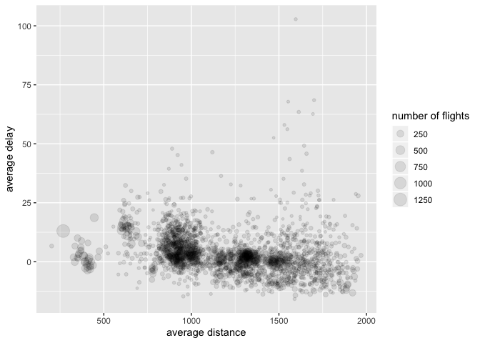

Lab 4: Data Wrangling
================

The `oilabs` package has a data set called `pnwflights` which contains
*all* of the flights that left from Seattle-Tacoma International Airport
and Portland International Airport from June 2016 to May 2017. We will
generate simple graphical and numerical summaries of data on these
flights and explore mainly delay times. As this is a large data set,
you’ll also get to practice the indispensable skills of data
processing and subsetting.

``` r
library(dplyr)
library(tidyr)
library(ggplot2)
library(oilabs)
data(pnwflights)
```

To get a sense of what this data frame contains the codebook can be
accessed by pulling up the help file:

``` r
?pnwflights
```

One of the variables refers to the carrier (i.e. airline) of the flight,
which is coded according to the following system.

  - `carrier`: Two letter carrier abbreviation.
      - `AA`: American Airlines Inc.
      - `AS`: Alaska Airlines Inc.
      - `B6`: JetBlue Airways
      - `DL`: Delta Air Lines Inc.
      - `F9`: Frontier Airlines Inc.
      - `HA`: Hawaiian Airlines Inc.
      - `NK`: Spirit Airlines Inc.
      - `OO`: SkyWest Airlines Inc.
      - `UA`: United Air Lines Inc.
      - `VX`: Virgin America
      - `WN`: Southwest Airlines Co.

<!-- end list -->

1.  Describe the distribution of departure delays for all flights using
    a histogram and appropriate summary statistics.

2.  Mutate the data frame so that it includes a new variable that
    contains the average speed, `avg_speed` traveled by the plane for
    each flight (in mph). Create a scatterplot of average speed
    vs. distance and describe the relationship. **Hint:** Average speed
    can be calculated as distance divided by number of hours of travel,
    and note that `air_time` is given in minutes.

3.  What proportion of the flights left from Portland? What is their
    most common destination? Most distant destination?

4.  Create a dataframe that contains the median and interquartile range
    for departure delays, grouped by carrier. Which carrier has the
    least variable departure delays?

5.  Using the airport nearest your hometown, which day of the week and
    which airline seems best for flying there from Portland? Be clear on
    how you’re defining *best*. (note that there is no explicit weekday
    column in this data set, but there is sufficient information to
    piece it together. The following line of code can be added to your
    pipeline to create that new column. It uses functions in the
    `lubridate` package, so be sure to load it in at the start of this
    exercise).

<!-- end list -->

``` r
mutate(day_of_week = wday(ymd(paste(year, month, day, set = "-")), label = T))
```

6.  Let’s consider any flight which has a departure delay of less than
    five minutes to be “on time,” and flights that are delayed for more
    than 5 minutes to be actually “delayed.” Given that, which month has
    the lowest proportion of delayed flights? **Hint:** Create a new
    variable that takes “on\_time” and “delayed” as values.

7.  The plot below displays the relationship between the mean arrival
    delay and the mean distance traveled by every plane in the data set.
    It also shows the total number of flights made by each plane by the
    size of the plotted circle. Please form a single chain that will
    create this plot, starting with the raw data set. You will also want
    to exclude the edge cases from your analysis, so focus on the planes
    that have logged more than 20 flights and flown an average distance
    of less than 2000 miles. The points can be made transparent by
    adding an argument to `geom_point()`: `alpha = .1`.

<!-- -->
