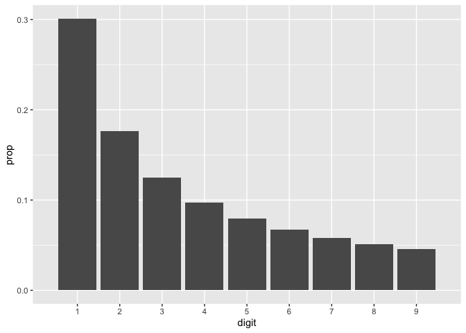

Lab 5: Hypothesis Testing
================

## 2009 Iran Election

On June 12 2009, the Republic of Iran held an election where President
Mahmoud Ahmadinejad sought re-election against three challengers. When
it was announced that Ahmadinejad had won with 62% of the vote, there
were widespread allegations of election fraud. There are many methods,
both quantitative and qualitative, to detect election fraud. In this lab
we will explore just one proposed method.

## Benford’s Law

Benford’s law observes that in many naturally-occuring phenomena with a
quantitative measurement, some patterns can be observed in the digits of
that measurement. Specifically, the law states that the first digit of
such observations, rather than being distributed uniformly between the
numbers 1-9, takes a decreasing log distribution. The code and plotted
distribution for this are below. Investments with interest, populations
of cities, and election results have all been observed by different
groups to follow Benford’s law.

``` r
benfords_p <- data.frame(first_digit = 1:9, 
                         ben_prop = log10(1 + 1/1:9))
```

<!-- -->

One purported method of detecting election fraud, then, is seeing if the
first digit of the results for each reporting region fits the
distribution specified by Benford’s law. Try this out with the Iran
data.

## Getting Started

### Load packages

For this lab we will read in the data using the `readr` package, explore
it using the `dplyr` package and visualize it using the `ggplot2`
package for data visualization. The data can be found in the `oilabs`
package.

``` r
library(readr)
library(dplyr)
library(ggplot2)
library(oilabs)
```

### Data

The election data from Iran contains 366 observations of 9 variables,
where every row is a city. The first two variables identify the province
and city the vote totals come from, the next four give vote totals for
the four candidates (Mahmoud Ahmadinejad, Mohsen Rezaee, Mehdi Karroubi,
and Mir-Hossein Mousavi), and the final three give total and procedural
vote totals.

``` r
data(iran)
```

## Elections

### Iran, 2009

1.  Add a column to the `iran` dataset called `first_digit` that
    contains the first digit of the votes cast for the winner, Mahmoud
    Ahmadinejad.

Hint: The `get_first()` function in the `oilabs` package will be useful
here. If you’re wondering how it works under the hood, try running the
following code line at the command line and inspecting the output.

``` r
substr("A long time ago, in a galaxy far far away...", 21, 28)
substr(387, 1, 2)
as.numeric(substr(387, 1, 2))
get_first(387)
```

2.  Create a bar plot like the one above, showing the frequencies of
    first digits in the total vote count. Does this plot appear to match
    the ideal Benford’s distribution? Where does it deviate?

This result might be due to election fraud, but it might just be a
result of a small sample size or other innocent factors. Try a similar
method on data collected from the 2016 US presidential election.

-----

### United States, 2016

The [OpenElections](http://www.openelections.net) project is obtaining
and standardizing precinct-level results from the 2016 US presidential
election, among other US elections. To access the data, search
OpenElections’ [GitHub page](https://github.com/openelections) and pick
an election that is marked “CSV” or “baked raw”.

3.  Pick a state and use this data to create a plot of that state’s
    first digit distribution by precinct. Use the number of votes cast
    for Hillary Clinton in each precinct. Make sure you remove rows for
    “total” counts if your state has them.

4.  Does the election you chose appear to fit the distribution better or
    worse than the Iran election?

### Election Assessment

We’ve used plots to assess the difference between the observed
distribution and the distribution expected by Benford’s Law, but it can
be useful to quantify that difference with a statistic. We can start by
building a dataframe that directly compares the proportions for each of
the digits.

5.  Using the `dplyr` techniques from the last lab, reformulate the
    `iran` data into the following dataframe and call it `iran_props`.

<!-- end list -->

    ## # A tibble: 9 x 3
    ##   first_digit obs_prop ben_prop
    ##         <dbl>    <dbl>    <dbl>
    ## 1           1   0.260    0.301 
    ## 2           2   0.232    0.176 
    ## 3           3   0.148    0.125 
    ## 4           4   0.0820   0.0969
    ## 5           5   0.0874   0.0792
    ## 6           6   0.0628   0.0669
    ## 7           7   0.0464   0.0580
    ## 8           8   0.0546   0.0512
    ## 9           9   0.0273   0.0458

6.  Formulate your own statistic to measure the distance between the
    observed proportions (`obs_prop`) and those expected by Benford’s
    Law (`ben_prop`). This exercise is similar to the first quiz, where
    you were asked to propose your own statistic to measure variability;
    there are many many possible choices, but some are more useful than
    others. Describe this statistic in words (or write out the formula
    for it if you are comfortable using LaTeX), then calculate it for
    this data.

7.  Repeat exerises 5 and 6 for the US state data. Which distribution is
    judged to be farther from the ideal Benford’s distribution using
    your distance statistic? What do you conclude about the presence of
    fraud in these elections?

-----

# Problem Set

Please work through problems 1, 2, 3, 5, and 10 in the Exercises at the
end of Chapter 2.
