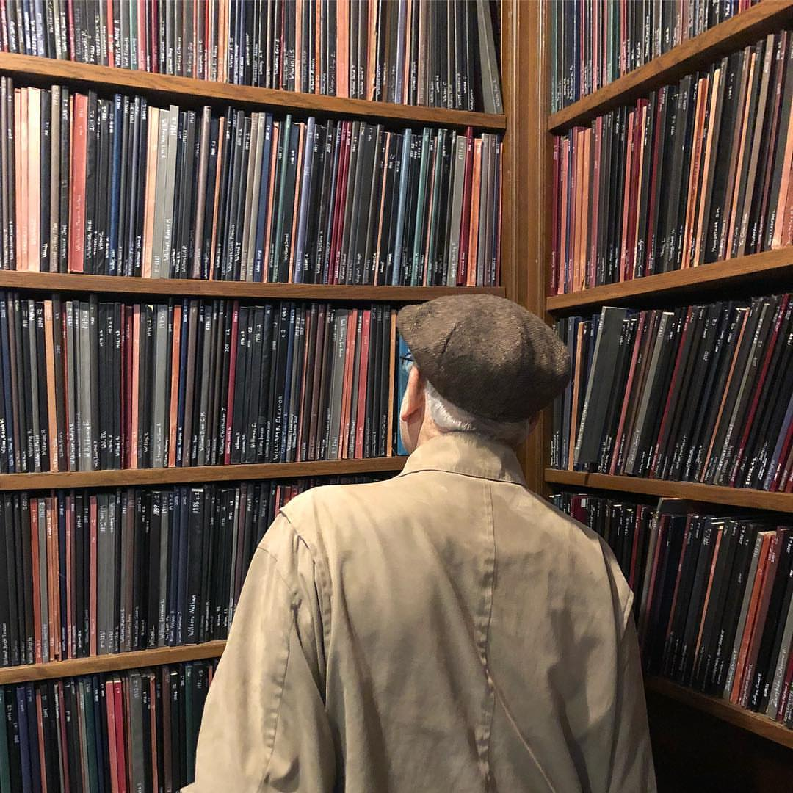

```{r setup, include=FALSE}
library(knitr)
options(digits=2)
knitr::opts_chunk$set(echo = TRUE)
library(dplyr)
library(ggplot2)
```

```{r out.width=800, echo = FALSE, fig.align='center'}

```

---
# Simple Random Sampling

**Protocol:** draw $n$ cases from population, each with equal probability.

--

- Pro: unbiased estimates, easy (?)
- Con: can be high variance

--

How can we draw theses with equal probability?


---
# Stratified Sampling

**Protocol**: partition population into *strata* that are different from one another, but are internally similar, w.r.t. a potentially influential variable.

--

What variables could influence number of checkouts?

- Discipline
- Year

--

How can we sample (proportionally) within these strata?


---
# Cluster Sampling

**Protocol**: partition population into *clusters* that are thought to be interchangable with one another. Take an SRS from those clusters and sample all cases with each cluster (or another SRS).

What could serve as a cluster?

- Columns
- Last name letter

---
# How many theses in the tower?

```{r out.width=400, echo = FALSE, fig.align='center'}

```

--

Estimates of $N$: 17,400; 37,450; 20,000; 15,000

---
# How do you approach this problem?

--

## Fermi Method

There are 25 columns of books, each with 7 shelves, each of which holds 75 theses.

$$
25 \times 5 \times 50 = 13,125\, \textrm{theses}
$$

--

## Statistical Method

Gather data: Mark-Recapture

---
# Mark-Recapture

.pull-left[

How many fish (N) are in a lake?

```{r out.width=400, echo = FALSE, fig.align='center'}

```
]

--

.pull-right[
**Protocol**:
1. Visit lake, catch and mark $n$ fish.
2. Release the fish and leave.
3. Return to lake and catch $K$ fish.
4. Count the number of marked fish $k$.
]

---
# Mark-Recapture

Estimating the total number of fish in the lake.

$$
\hat{N} = \frac{Kn}{k}
$$

--

Would this work for estimating the total number of theses?

--

- It's not easy to randomly "catch" a thesis.


---
# Practical Issues

--

- Changing division names

--

- Missing cards

--

- Reshelving books

