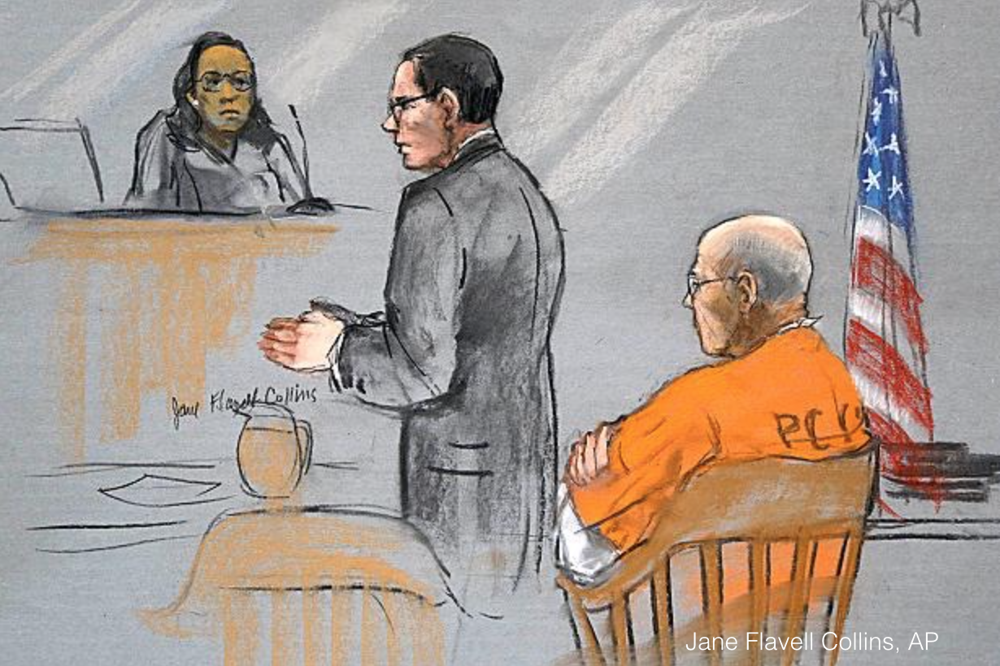
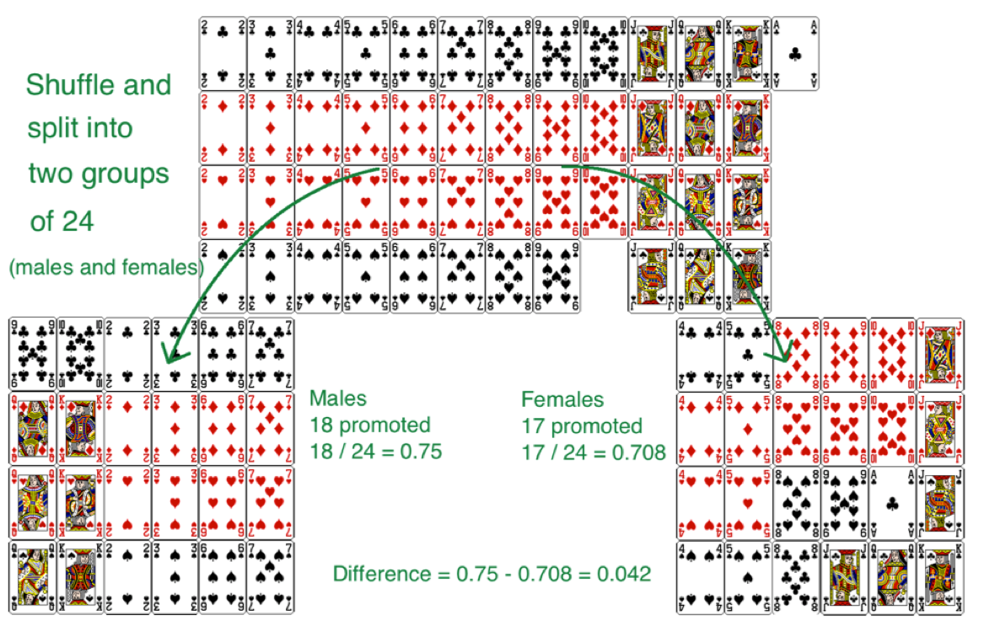

```{r setup, include=FALSE}
library(knitr)
options(digits=2)
knitr::opts_chunk$set(echo = TRUE)
library(dplyr)
library(ggplot2)
```

# Case study

---
# Gender Discrimination

.pull-left[
```{r out.width=600, echo = FALSE, fig.align='center'}
knitr::include_graphics("figs/equal-pay.jpg")
```
]

.pull-right[  
  - 48 male supervisors given the same personnel file.
  - Asked: promote or not.
  - Files were identical except gender.
  - Files were randomly assigned to the supervisors.
  - Goal: are females unfairly discriminated against?
]

---
# Data

Gender | promote | nopromote 
-------|---------|-----------
Male   |    21   |    3      
Female |    14   |    10    

--

$$P(promote\,|\,M) = 21/24 = 0.875 \\
P(promote\,|\,F) = 14/24 = 0.583$$

--

At a first glance, does there appear to be a relatonship between promotion and 
gender?


---
# Question

We saw a difference of almost 30% (29.2% to be exact) between the proportion of male and female files that are promoted. Based on this information, which of the below is true?

<ol type="a">
  <li>If we were to repeat the experiment we will definitely see that more female files get promoted. This was a fluke.</li>
  <li>Promotion is dependent on gender, males are more likely to be promoted, and hence there is gender discrimination against women in promotion decisions.</li>
  <li>The difference in the proportions of promoted male and female files is due to chance, this is not evidence of gender discrimination against women in promotion decisions.</li>
  <li>Women are less qualified than men, and this is why fewer females get promoted.</li>
</ol>


---
# Two competing claims

$H_0$, **Null Hypothesis**: "There is nothing going on".

- Promotion and gender are independent.

--
- No gender discrimination.

--
- Observed difference in proportions is simply due to chance.

--

$H_A$, **Alternative Hypothesis**: There is something going on.”

- Promotion and gender are dependent.

--
- There is gender discrimination.

--
- Observed difference in proportions is not due to chance.


---
# Trial as a Hypothesis test

```{r out.width=400, echo = FALSE, fig.align='center'}

```
  
**H0**  : Defendant is innocent  vs.  **HA**  : Defendant is guilty

- Present evidence / collect data.

--
- Judge the evidence - “Could these data plausibly have happened by chance if the null hypothesis were true?"

--
- If they were very unlikely to have occurred, then the evidence raises more than a reasonable doubt in our minds about the null hypothesis.


---
# If the evidence is weak

- If the evidence is not strong enough to reject the assumption of innocence, the jury returns with a verdict of *not guilty*.
    - The jury does not say that the defendant is innocent, just that there is not enough evidence to convict.
- Said statistically: *we fail to reject the null hypothesis*, or *the data is consistent with our model*.
    - We never *accept the null hypothesis*.
    


---

# Why don't we accept $H_0$?

--

The hypothesis test gives us:

$$ P(\textrm{data}\,|\,\textrm{H}_0) $$

--

It doesn't give us:

$$ P(\textrm{H}_0\,|\,\textrm{data}) $$

---
# Recap: Hypothesis Testing

- Start with a null hypothesis ( $H_0$ ) that represents the status quo.

--
- We also have an alternative hypothesis ( $H_A$ ) that represents our research question, i.e. what we're testing for.

--
- We conduct a hypothesis test under the assumption that $H_0$ is true, either via simulation (this week) or theoretical methods (later in the course).

--
- If the test results suggest that the data is consistent with $H_0$, we stick with the $H_0$. If they are inconsistent, then we reject the $H_0$ in favor of $H_A$.


---
# Gender discrimination: $H_0$ test

What is the *null hypothesis*?

--
- $H_0$: There is no gender discrimination
- $H_0$: Gender and promotion are independent

--

What is the *alternative hypothesis*?

--
- $H_A$: There is gender discrimination
- $H_A$: Gender and promotion are not independent

--

What is our *test statistic*?

--
- $d = \hat{p}_{M} - \hat{p}_{F}$


---
# Recall: the data

Gender | promote | nopromote 
-------|---------|-----------
Male   |    21   |    3      
Female |    14   |    10    


We can compute our observed test statistic:

$$d_{obs} = \hat{p}_{M} - \hat{p}_{F} \\
d_{obs} = 21/24 - 14/24 = .29$$


---

```{r out.width=750, echo = FALSE, fig.align='center'}
knitr::include_graphics("figs/gender-cards1.png")
```

**Face cards**: note promoted  
**Number cards**: promoted


---
# Constructing the Null Distribution

1. Shuffle the deck and deal into two piles of twenty four.
2. This mimicks the process of each supervision being randomly assigned a male or female file.
3. Compute the proportion that is promoted in each:

$$d = \hat{p}_{M} - \hat{p}_{F}$$

Repeat steps 1-3 and store each one.


---

```{r out.width=750, echo = FALSE, fig.align='center'}

```


---
# Randomization using R

```{r simgender, fig.width = 8, echo = FALSE, message = FALSE}
gender <- rep(c("M", "F"), each = 24)
promote <- rep(c("Yes", "No"), c(35, 13))
paygap <- tibble(gender, promote)

library(infer)
null <- paygap %>%
  specify(response = promote,
          explanatory = gender,
          success = "Yes") %>%
  hypothesize(null = "independence") %>%
  generate(reps = 1000, types = "permute") %>%
  calculate(stat = "diff in props",
            order = c("M", "F"))

null %>%
  visualize() +
  shade_pvalue(obs_stat = .29, direction = "both")
```


---
# Question

Do the results of the simulation you just ran provide convincing evidence of gender discrimination against women, i.e. dependence between gender and promotion decisions?

**A)** No, the data do not provide convincing evidence for the alternative hypothesis, therefore we can't reject the null hypothesis of independence between gender and promotion decisions. The observed difference between the two proportions was due to chance.

**B)** Yes, the data provide convincing evidence for the alternative hypothesis of gender discrimination against women in promotion decisions. The observed difference between the two proportions was due to a real effect of gender.


---
# A p-value

```{r echo = FALSE}
get_pvalue(null, obs_stat = .29, direction = "both")
```

