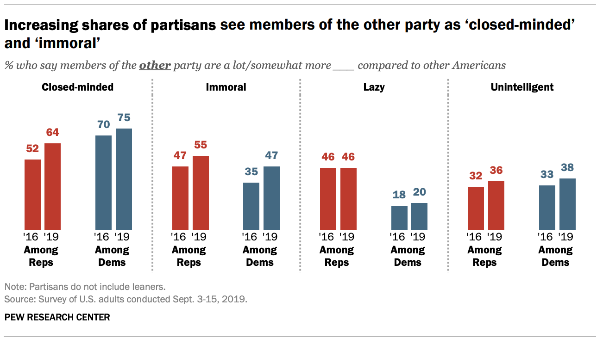

```{r include = FALSE}
knitr::opts_chunk$set(fig.align='center', error = TRUE)
library(tidyverse)
library(infer)
set.seed(304)
```


---
# Returning to Pew . . .

--

```{r out.width=800, echo = FALSE, fig.align='center'}

```

--

Was there really an increase in the proportion of Democrats that view Republicans as lazy or is that just sampling variability?

---
# The Data

--

```{r}
pew <- data.frame(party = "Democrat",
                  year = rep(c(2016, 2019), 
                             c(4947, 4947)),
                  lazy = c(rep(c("yes", "no"),
                               c(890, 4057)),
                           rep(c("yes", "no"),
                               c(989, 3958))))
```

--

```{r}
slice(pew, 1:5)
```

---
# The Data

```{r}
pew <- data.frame(party = "Democrat",
                  year = rep(c(2016, 2019), 
                             c(4947, 4947)),
                  lazy = c(rep(c("yes", "no"),
                               c(890, 4057)),
                           rep(c("yes", "no"),
                               c(989, 3958))))
```

```{r}
slice(pew, 4946:4950) #<<
```


---
# Visualization

--

```{r fig.height = 5}
library(tidyverse)
ggplot(pew, aes(x = year, fill = lazy)) +
  geom_bar()
```


---
# Point estimate

--

```{r pewinf, eval = FALSE}
library(infer)
(point_est <- pew %>%
  specify(response = lazy, 
          explanatory = year, 
          success = "yes") %>%
  calculate(stat = "diff in props",
            order = c(2019, 2016)) %>%
  pull())
```

--

```{r ref.label="pewinf", echo = FALSE}
library(infer)
(point_est <- pew %>%
  specify(response = lazy, 
          explanatory = year, 
          success = "yes") %>%
  calculate(stat = "diff in props",
            order = c(2019, 2016)) %>%
  pull())
```


---
# Point estimate

```{r pewinf2, eval = FALSE}
library(infer)
(point_est <- pew %>%
  mutate(year = factor(year)) %>% #<<
  specify(response = lazy, 
          explanatory = year, 
          success = "yes") %>%
  calculate(stat = "diff in props",
            order = c(2019, 2016)) %>%
  pull())
```

--

```{r ref.label="pewinf2", echo = FALSE}
library(infer)
(point_est <- pew %>%
  mutate(year = factor(year)) %>% #<<
  specify(response = lazy, 
          explanatory = year, 
          success = "yes") %>%
  calculate(stat = "diff in props",
            order = c(2019, 2016)) %>%
  pull())
```

--

```{r}
pew <- mutate(pew, year = factor(year))
```


---
# Bootstrapping the SE

--

```{r pewinf3, eval = FALSE}
(boot <- pew %>%
  specify(response = lazy, 
          explanatory = year, 
          success = "yes") %>%
  generate(reps = 500, #<<
           type = "bootstrap") %>% #<<
  calculate(stat = "diff in props",
            order = c(2019, 2016)))
```

--

```{r ref.label="pewinf3", echo = FALSE}
(boot <- pew %>%
  specify(response = lazy, 
          explanatory = year, 
          success = "yes") %>%
  generate(reps = 500, #<<
           type = "bootstrap") %>% #<<
  calculate(stat = "diff in props",
            order = c(2019, 2016)))
```


---
# The Bootstrap Distribution

--

```{r bootviz, eval = FALSE}
boot %>% 
  visualize()
```

--

```{r ref.label="bootviz", echo = FALSE, fig.height=5.5}
boot %>% 
  visualize()
```


---
# The Bootstrap SE

```{r bootse, eval = FALSE}
(boot_se <- boot %>%
  summarize(se = sd(stat)) %>%
  pull())
```

--

```{r ref.label="bootse", echo = FALSE}
(boot_se <- boot %>%
  summarize(se = sd(stat)) %>%
  pull())
```

--

### Construct the CI

```{r}
c(point_est - 1.96 * boot_se,
  point_est + 1.96 * boot_se)
```


---
# Alternative: Normal Approximation

--

Conditions for the sampling distribution of $\hat{p}_1 - \hat{p}_2$ to be normal:

--

- each proportion separately follows a normal model
- the two samples are independent of one another

--

The standard error can be estimated with:

$$ \widehat{SE} = \sqrt{\frac{\hat{p}_1 ( 1 - \hat{p}_1)}{n_1} + \frac{\hat{p}_2 ( 1 - \hat{p}_2)}{n_2}} $$


---

```{r out.width=800, echo = FALSE, fig.align='center'}

```

--

.tiny[
```{r}
hiv <- data.frame(treatment = rep(c("Nevaripine", "Lopinavir"),
                                  c(120, 120)),
                  outcome = c(rep(c("worse", "not worse"),
                                  c(26, 94)),
                              rep(c("worse", "not worse"),
                                  c(10, 110))))
table(hiv)
```
]
