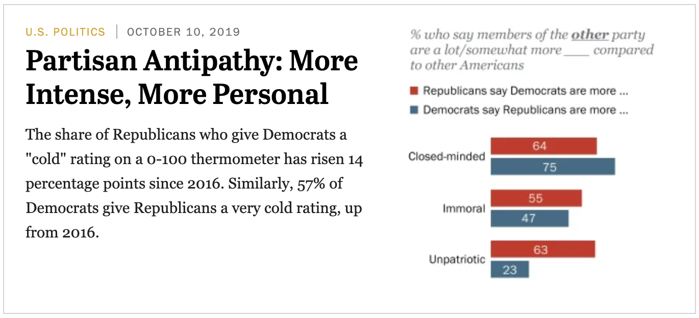
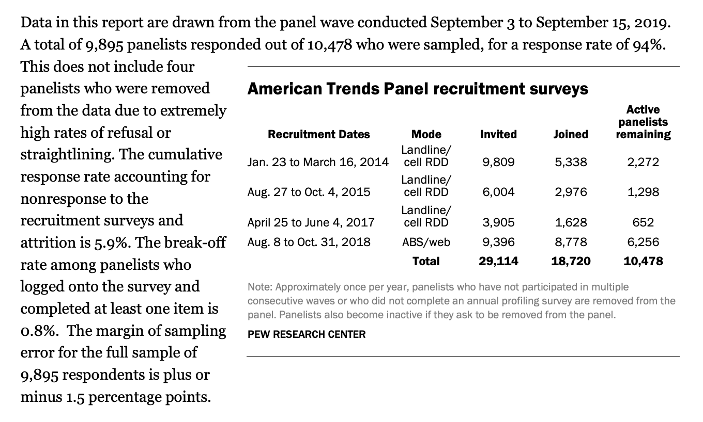

```{r include = FALSE}
knitr::opts_chunk$set()
library(tidyverse)
library(infer)
set.seed(304)
```


```{r out.width=800, echo = FALSE, fig.align='center'}

```

---

```{r out.width=800, echo = FALSE, fig.align='center'}
knitr::include_graphics("figs/pew2.png")
```

---

```{r out.width=800, echo = FALSE, fig.align='center'}

```

---

Boardwork

---
# Pew Data

How much uncertainty do we have in our estimate (64%) of the proportion of Republicans that think Democrats are more close-minded?

--

```{r pew1, eval = FALSE}
pew <- data.frame(party = "Republican",
                  closed = rep(c("yes", "no"),
                                     c(3166, 1781)))
head(pew)
```

--

```{r ref.label = "pew1", echo = FALSE}
pew <- data.frame(party = "Republican",
                  closed = rep(c("yes", "no"),
                                     c(3166, 1781)))
head(pew)
```

---
# Bootstrapping p-hat I

```{r pew2, eval = FALSE}
pew %>%
  specify(response = closed, success = "yes") %>%
  generate(reps = 100, type = "bootstrap") 
```

--

```{r ref.label = "pew2", echo = FALSE}
pew %>%
  specify(response = closed, success = "yes") %>%
  generate(reps = 100, type = "bootstrap") 
```

---
# Bootstrapping p-hat II

```{r pew3, eval = FALSE}
pew %>%
  specify(response = closed, success = "yes") %>%
  generate(reps = 100, type = "bootstrap") %>%
  calculate(stat = "prop") #<<
```

--

```{r ref.label = "pew3", echo = FALSE}
pew %>%
  specify(response = closed, success = "yes") %>%
  generate(reps = 100, type = "bootstrap") %>%
  calculate(stat = "prop") #<<
```

---
# Bootstrapping p-hat III

```{r pew4, eval = FALSE}
pew %>%
  specify(response = closed, success = "yes") %>%
  generate(reps = 100, type = "bootstrap") %>%
  calculate(stat = "prop") %>%
  visualize() #<<
```

--

```{r ref.label = "pew4", echo = FALSE, fig.align="center", fig.height=4}
pew %>%
  specify(response = closed, success = "yes") %>%
  generate(reps = 100, type = "bootstrap") %>%
  calculate(stat = "prop") %>%
  visualize() #<<
```

---
# Bootstrapping p-hat III

```{r}
boot_se <- pew %>% #<<
  specify(response = closed, success = "yes") %>%
  generate(reps = 100, type = "bootstrap") %>%
  calculate(stat = "prop") %>%
  summarize(se = sd(stat)) %>% #<<
  pull() #<<
```

--

```{r}
boot_se
```


---
# Constructing a CI

$$ \hat{p} \pm 1.96 \times SE $$

--

```{r}
p_hat <- pew %>%
  specify(response = closed, success = "yes") %>%
  calculate(stat = "prop") %>%
  pull()
```

--

```{r}
p_hat
```

--

```{r}
c(p_hat - 1.96 * boot_se, p_hat + 1.96 * boot_se)
```

---
# 


---
# Normal Approximation Method

The sampling distribution of the point estimate $\hat{p}$ can be approximated with:
  
$\hat{p} \sim N(\mu = p, \sigma = \sqrt{\frac{p(1-p)}{n}})$ if

--

1. Observations are independent
2. The number of observed successes and failures is more than 10.

$$n\hat{p} \ge 10 \\
n(1 - \hat{p}) \ge 10$$

---
# Question

We are given that $n = 4947, \hat{p} = 0.64$. Which of the
below is the correct calculation of the 95% confidence interval?

1. $0.64 \pm 1.96 \sqrt{(.64 \times 0.36)/4947}$
2. $0.64 \pm 1.65 \sqrt{(.64 \times 0.36)/4947}$
3. $0.64 \pm 1.96 ((.64 \times 0.36)/\sqrt{4947})$
4. $64 \pm 1.96 \sqrt{(64 \times 36)/4947}$


---
# Constructing a CI

--

```{r construct}
nrow(pew) * p_hat
nrow(pew) * (1 - p_hat)
```

--

```{r}
approx_SE <- sqrt((p_hat * (1 - p_hat)) / 
                    nrow(pew))
```

--

```{r}
approx_SE
```


---
# Constructing a CI, cont.

```{r}
z_star <- qnorm(.025) # for a 95% CI
```

--

```{r}
z_star
```

--

```{r}
(MoE <- z_star * approx_SE)
```

--

```{r}
c(p_hat - MoE, p_hat + MoE)
```


---
# Choosing between methods

--

### Bootstrap SE

- Must have sufficiently large sample (n > 30)
- Can be calculated for any statistic

--

### Normal approximation

- Must satisfy assumptions (independence, sample size)
- Most commonly used (still)


---

```{r out.width=600, out.height = 300, echo = FALSE, fig.align='center'}
knitr::include_graphics("figs/pew2.png")
```

Our estimate for the proportion of Republicans that view Democrats as more close-minded is 64% with a margin of error of 1.3%.

--

We're 95% confident that the true proportion of Republicans that view Democrats as more close-minded is between 62.6% and 65.3%.
