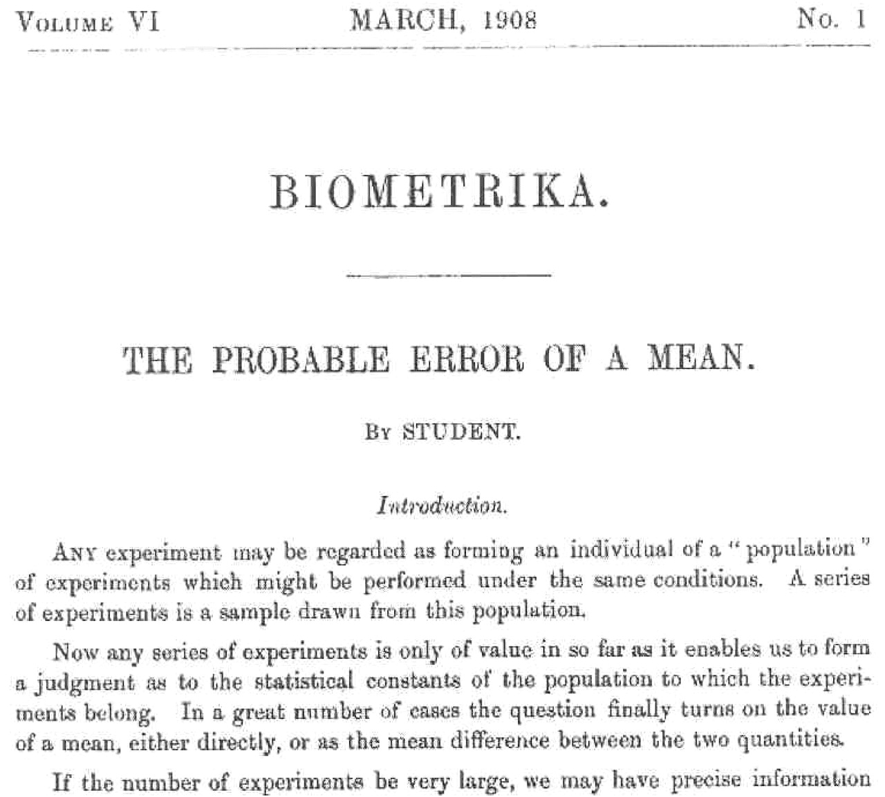

```{r setup, include=FALSE}
library(knitr)
options(digits=3)
knitr::opts_chunk$set(echo = TRUE)
library(dplyr)
library(ggplot2)
library(oilabs)
```


```{r out.width=350, echo = FALSE, fig.align='center'}

```

---

.pull-left[
```{r out.width=350, echo = FALSE, fig.align='center'}
knitr::include_graphics("figs/gosset.jpg")
```

Meet William Sealy Gosset.
]

--
.pull-right[
**Problem**: A batch of beer should have a fixed [chemical level related to barley]
in order to be of good quality. Can you test a small number of barrels and infer
if the entire batch is of good enough quality?
]


---

```{r out.width=650, echo = FALSE, fig.align='center'}

```

---

```{r out.width=800, echo = FALSE, fig.align='center'}
knitr::include_graphics("figs/gosset-plaque.jpg")
```

<!--
 One version of the origin of the pseudonym is that Gosset’s employer preferred staff to use pen names when publishing scientific papers instead of their real name, so he used the name “Student” to hide his identity. Another version is that Guinness did not want their competitors to know that they were using the t-test to determine the quality of raw material.
-->

---
# The $t$ distribution
--

Used to estimate the mean when you have a small sample drawn from a nearly
normal population.

--

### Conditions
- Independent observations ( $n < 0.1 N$)
- Nearly normal population distribution
    - Check distribution of the sample as a proxy

---
## $t$ versus normal
--

```{r tdist, echo = FALSE, fig.height=5.5, fig.align="center"}
ggplot(NULL, aes(x=x, colour = distribution)) +
  stat_function(data = data.frame(x = -4:4, distribution= factor(1)), 
                fun = dt, args = c(df = 1)) +
  stat_function(data = data.frame(x = -4:4, distribution = factor(2)), 
                fun = dt, args = c(df = 2)) +
  stat_function(data = data.frame(x = -4:4, distribution = factor(3)), 
                fun = dt, args = c(df = 5)) +
  stat_function(data = data.frame(x = -4:4, distribution = factor(4)), 
                fun = dt, args = c(df = 30)) +
  stat_function(data = data.frame(x = -4:4, distribution = factor(5)), 
                fun = dnorm) +
  scale_colour_manual(values = c("orangered4", "orangered3", 
                                 "orangered2", "orangered", "goldenrod"),
                      labels = c("df = 1", "df = 2", "df = 5", "df = 30", "normal")) +
  theme_bw()
```

The $t$ has heavier tails than the normal distribution.

---
## Degrees of Freedom
--

*The number of parameters that are free to vary, without violating any constraint imposed on it*.

--

### Parameters
$\mu$

Since $\bar{x} = \frac{1}{n}\sum_{i = 1}^n x_i$, one of our *observations* is constrained, leaving $n-1$ 
that are free to vary.

$$ df = n - 1$$

---
# Hypothesis testing
--

1. State hypotheses: e.g. $H_0: \mu = \mu_0$ versus $H_A: \mu \ne \mu_0$
--

2. Check conditions
    - Independent observations  
    - Nearly normal population
--

3. Compute observed $t$-statistic $$ t_{obs} = \frac{\bar{x} - \mu_0}{s/\sqrt{n}} $$
--

4. Draw picture to assess where $t_{obs}$ falls in $t_{df = n - 1}$
--

5. Compute a (two-tailed) $p$-value
--

6. State conclusion


---
# Confidence interval for $\mu$
--

point estimate $\pm$ margin of error

$$ \bar{x} \pm (t^*_{df} \times SE) $$

- $\bar{x}$: point estimate of $\mu$.
- $t^*_{df}$: critical value that leaves $\alpha$ in the tails of a $t$ with 
$df = n - 1$.
- $SE$: standard error of $\bar{x}$, $s/\sqrt{n}$.

---
# Finding $p$-values and $t^*_{df}$
--

```{r pt1, eval = FALSE}
pt(-2.2, df = 18)
```

--

```{r ref.label = "pt1", echo = FALSE}
pt(-2.2, df = 18)
```

--

```{r qt1, eval = FALSE}
qt(.025, df = 18)
```

--

```{r ref.label = "qt1", echo = FALSE}
qt(.025, df = 18)
```

--

- Use the [applet](http://ismay.shinyapps.io/ProbApp)


---
# Example: The Kilogram
--

How do we know how much a kilogram weighs?


---
# Example: The Kilogram, cont.
--

Meet the IPK: International Prototype Kilogram, Paris, France.

```{r out.width=400, echo = FALSE, fig.align='center'}

```


---
# Example: The Kilogram
--

**Question**

The US has two copies of the IPK. Say they make a third copy for Reed. We take 6 measures of our new RPK and get the following:

```{r echo = FALSE}
c(0.997, 0.976, 1.032, 1.101, 1.004)
```

Is it a safe assumption that the RPK weighs the same as the IPK?


---
## RIP IPK

```{r out.width=400, echo = FALSE, fig.align='center'}

```

--

```{r out.width=400, echo = FALSE, fig.align='center'}

```
