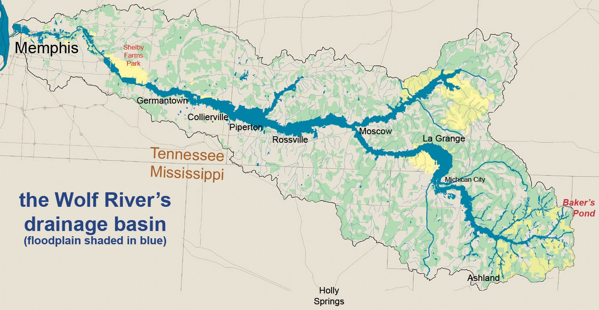

```{r setup, include=FALSE}
library(knitr)
options(digits=3)
knitr::opts_chunk$set(echo = TRUE)
library(dplyr)
library(ggplot2)
library(oilabs)
library(infer)
library(openintro)
```

# Wolf River
--

```{r out.width=700, echo = FALSE, fig.align='center'}

```

--

- The Wolf River in Tennessee flows past an abandoned site once used by the 
pesticide industry for dumping wastes, including hexachlorobenzene (HCB).
- HCB known to cause various cancers and birth defects.


---
# Wolf River study
--

- Standard method to test whether HCB is present in a river is to take samples at middepth.
- HCB is denser than water, so is it found at different concentrations at 
different depths?

--

```{r wolf-data, echo=2:3}
wolf <- read.table("../data/wolfriver.txt", header = TRUE)
str(wolf)
head(wolf)
```


---
# Wolf River data
--

```{r wolf-boxes, echo = FALSE, fig.align="center", fig.height = 6, fig.width=8}
ggplot(wolf, aes(x = Depth, y = HCB)) +
  geom_boxplot() +
  theme_bw(base_size = 18)
```


---
# Wolf River data, cont.
--

```{r wolf-densities, echo = FALSE, fig.align="center", fig.height = 6, fig.width=9}
ggplot(wolf, aes(x = HCB, fill = Depth, color = Depth)) +
  geom_density(alpha = .3) +
  theme_bw(base_size = 18)
```


---

Which of the following plots shows groups with means that are *most* and *least*
likely to be significantly different from each other?

--

```{r out.width=700, echo = FALSE, fig.align='center'}
knitr::include_graphics("figs/3-anovas.png")
```

1. most: I, least: II 
2. most: II, least: III
3. most: I, least: III
4. most: III, least: II


---
boardwork

---

Which of the following plots shows groups with means that are *most* and *least*
likely to be significantly different from each other?

```{r out.width=700, echo = FALSE, fig.align='center'}
knitr::include_graphics("figs/3-anovas.png")
```

--

- I has a high F.
- II has a low F.
- III has a middling F.


---
# Wolf River data
--

```{r wolf-boxes2, echo = FALSE, fig.align="center", fig.height = 5}
ggplot(wolf, aes(x = Depth, y = HCB)) +
  geom_boxplot() +
  theme_bw(base_size = 18)
f <- anova(aov(HCB ~ Depth, data = wolf))
f[, 1:4]
```

How big is `r f$F[1]`?


---
# ANOVA F-test
--

$$ H_0: \mu_1 = \mu_2 = \ldots = \mu_k $$
$$ H_A: \textrm{At least one } \mu_j \textrm{ is different} $$

--

We can find the distribution of the F-statistic under the null hypothesis by

- Randomization
- Mathematical approximation

---
# Sampling dist for F via Randomization
--

```{r randoF2}
null <- wolf %>%
  specify(response = HCB, explanatory = Depth) %>%
  hypothesize(null = "independence") %>%
  generate(reps = 1000, type = "permute") %>%
  calculate(stat = "F")
```


---
# Sampling dist for F via Randomization, cont.
--

```{r fig.align="center", fig.height = 5}
null %>%
  visualize() +
  shade_p_value(obs_stat = f$F[1],
                direction = "right")
```


---
# Sampling dist for F via Randomization, cont.
--

```{r fig.align="center", fig.height = 5}
null %>%
  get_p_value(obs_stat = f$F[1], 
              direction = "right")
```


---
# Sampling dist for F via Approximation

If:

1. Independent observations.
2. Approximate normal distributions within groups.
3. Constant variance between groups.

--

Then the sampling distribution for the $F$ statistic under the $H_0$ is well approximated by an F distribution with $df_1 = k - 1$ and $df_2 = N - k$. The p-value is represented by the upper tail.

```{r f-output}
1 - pf(f$F[1], df1 = 2, df2 = 30 - 3)
```

---

```{r fig.align="center", fig.height = 5, warning = FALSE}
null %>%
  visualize(method = "both") +
  shade_p_value(obs_stat = f$F[1],
                direction = "right")
```


---
## Wolf River Conclusions
--

```{r conc, , fig.align="center", fig.height = 5, echo = FALSE}
ggplot(wolf, aes(x = Depth, y = HCB)) +
  geom_boxplot() +
  theme_bw()
```

- With a p-value of $\approx 0.07$, it is questionable whether HCB concentration
functions the same at all three depths.
- *Replicating the study* could add some certainty.
- In a subsequent study, we may wish to only test middepth versus bottom.


