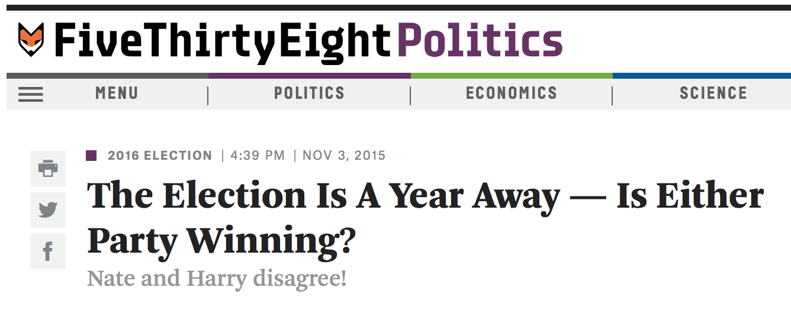
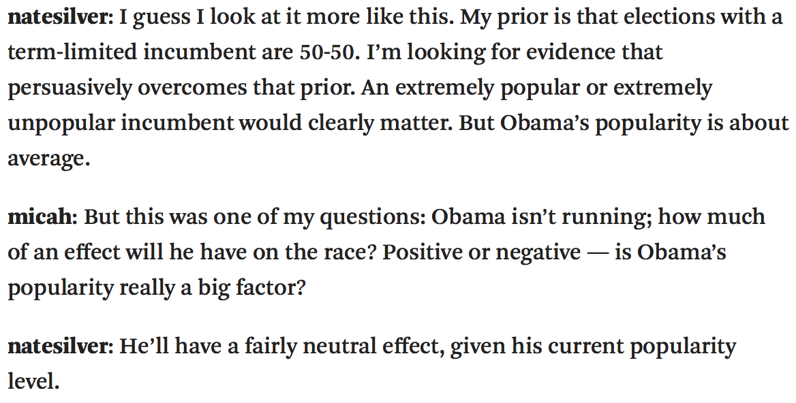
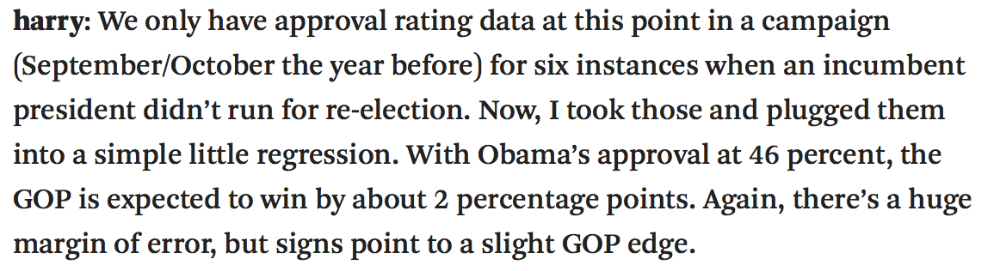

```{r setup, include=FALSE}
library(knitr)
options(digits=3)
knitr::opts_chunk$set(echo = TRUE, fig.align = "center", fig.width = 8, 
                      fig.height = 5, message = FALSE, warning = FALSE)
library(dplyr)
library(ggplot2)
library(oilabs)
library(openintro)
set.seed(764)
```

# Some chatter from the internets
--

## 2016 Election

```{r out.width=700, echo = FALSE, fig.align='center'}

```

--

**Question at hand**: How will Obama's 46% approval rating effect his
party's candidate for the 2016 presidential election?


---

```{r out.width=700, echo = FALSE, fig.align='center'}

```


---

```{r out.width=700, echo = FALSE, fig.align='center'}

```

--

How would you visualize this data?

---

```{r out.width=700, echo = FALSE, fig.align='center'}
knitr::include_graphics("figs/538-3.png")
```

--

Why is it ridiculous?

---
# Inference for Regression
--

We can fit a line through any cloud of points that we please, but if we
just have a *sample* of data, any trend we detect doesn't necessarily 
demonstrate that the trend exists in the *population* at large.


---
# Plato's Allegory of the Cave
--

```{r out.width=700, echo = FALSE, fig.align='center'}

```


---
# Statistical Inference
--

**Goal**: use *statistics* calculated from data to makes inferences about the 
nature of *parameters*.

--

In regression,

- parameters: $\beta_0$, $\beta_1$
- statistics: $b_0$, $b_1$

Classical tools of inference:

- Confidence Intervals
- Hypothesis Tests


---
# Unemployment and elections
--

```{r echo = FALSE}
library(openintro)
data(unempl)
data(house)
data(president); pres <- president
year   <- seq(1898, 2010, 4)+1
n      <- length(year)
unemp  <- rep(0, n)
change <- rep(0, n)
presid <- rep("", n)
party  <- rep("", n)
for(i in 1:n){
	urow <- which(unempl$year == year[i]-1)
	if(i < n){
		prow <- which(pres$end > year[i])[1]
	} else {
		prow <- which(pres$potus == "Barack Obama")
	}
	hrow <- which(house$yearEnd >= year[i])[1]
	party[i] <- as.character(pres$party[prow])
	if(substr(house$p1[hrow],1,5) == substr(party[i],1,5)){
		oldHouse <- house$np1[hrow] / house$seats[hrow]
	} else {
		oldHouse <- house$np2[hrow] / house$seats[hrow]
	}
	if(substr(house$p1[hrow+1],1,5) == substr(party[i],1,5)){
		newHouse <- house$np1[hrow+1] / house$seats[hrow+1]
	} else {
		newHouse <- house$np2[hrow+1] / house$seats[hrow+1]
	}
	change[i] <- (newHouse - oldHouse)/oldHouse * 100
	presid[i] <- as.character(pres$potus[prow])
	unemp[i]  <- unempl$unemp[urow]
}

unemployPres <- data.frame(year=year, potus=presid, party=party, unemp=unemp, change=change)
unemployPres[29, 3] <- "Democratic"
levels(unemployPres$party) <- levels(unemployPres$party)[c(1, 3, 2)]
levels(unemployPres$party)[2:3] <- c("Rep", "Dem")
```

```{r echo = FALSE}
p1 <- unemployPres %>%
  ggplot(aes(x = unemp, y = change, col = party)) +
  geom_point(size = 3) +
  theme_bw(base_size = 14) +
  xlab("Unemployment") +
  ylab("Total change of seats in Congress")
p1
```

--

**Reigning theory**: voters will punish candidates from the Presidents party
at the ballot box when unemployment is high.


---
# Unemployment and elections

```{r echo=FALSE}
m1 <- lm(change ~ unemp, data = unemployPres)
p1 +
  geom_abline(intercept = m1$coef[1], slope = m1$coef[2])
```

**Reigning theory**: voters will punish candidates from the Presidents party
at the ballot box when unemployment is high.


---
# Unemployment and elections, cont.
--

```{r echo = FALSE}
library(dplyr)
ump <- filter(unemployPres, unemp < 15)
m0 <- lm(change ~ unemp, data = ump)
p2 <- ump %>%
  ggplot(aes(x = unemp, y = change, col = party)) +
  geom_point(size = 3) +
  theme_bw(base_size = 14) +
  xlab("Unemployment") +
  ylab("Total change of seats in Congress") +
  geom_abline(intercept = m0$coef[1], slope = m0$coef[2])
p2
```

--

Some evidence of a negative linear relationship between unemployment level
and change in party support - or is there?


---
# H-test for Regression
--

$H_0:$ There is no relationship between unemployment level and change in 
party support (or: change in party support is independent of unemployment).

$H_0: \beta_1 = 0$

--

## Method
If there is no relationship, the pairing between $X$ and $Y$ is
artificial and we can permute:

1. Create synthetic data sets under $H_0$ by shuffling $X$.
2. Compute a new regression line for each data set and store each $b_1$.
3. See where your observed $b_1$ falls in the distribution of $b_1$'s under $H_0$.


---
# Your turn

Take a moment to sketch out the infer pipeline that will results in a collection of 500 slopes that would might see in a world where the null hypothesis was true.


---
class: small
# First shuffle

```{r shuf1, eval = FALSE}
library(infer)
ump %>%
  specify(change ~ unemp) %>%
  hypothesize(null = "independence") %>%
  generate(1, type = "permute")
```

--

```{r ref.label = "shuf1", echo = FALSE}
library(infer)
ump %>%
  specify(change ~ unemp) %>%
  hypothesize(null = "independence") %>%
  generate(1, type = "permute")
```


---
class: small
# Second shuffle

```{r }
shuffle2 <- ump %>%
  specify(change ~ unemp) %>%
  hypothesize(null = "independence") %>%
  generate(1, type = "permute")
shuffle2
```


---
class: small
# Second shuffle, visualized

```{r shufplot, eval = FALSE}
shuffle2 %>%
  ggplot(aes(x = unemp, y = change)) +
  geom_point(size = 3) +
  theme_bw(base_size = 14) +
  xlab("Unemployment") +
  ylab("Total change of seats in Congress")
```

--

```{r ref.label = "shufplot", echo = FALSE, fig.height = 4.5}
shuffle2 %>%
  ggplot(aes(x = unemp, y = change)) +
  geom_point(size = 3) +
  theme_bw(base_size = 14) +
  xlab("Unemployment") +
  ylab("Total change of seats in Congress")
```


---
class: small
# Second shuffle, visualized

```{r shuf1lm, eval = FALSE, fig.height = 4.5}
shuffle2 %>%
  ggplot(aes(x = unemp, y = change)) +
  geom_point(size = 3) +
  theme_bw(base_size = 14) +
  xlab("Unemployment") +
  ylab("Total change of seats in Congress") +
  stat_smooth(method = "lm", se = FALSE)
```

--

```{r ref.label = "shuf1lm", echo = FALSE, fig.height = 4.5}
shuffle2 %>%
  ggplot(aes(x = unemp, y = change)) +
  geom_point(size = 3) +
  theme_bw(base_size = 14) +
  xlab("Unemployment") +
  ylab("Total change of seats in Congress") +
  stat_smooth(method = "lm", se = FALSE)
```


---
class: small
# Third shuffle, visualized
--

```{r echo = FALSE}
shuffle3 <- ump %>%
  specify(change ~ unemp) %>%
  hypothesize(null = "independence") %>%
  generate(1, type = "permute")
```


```{r shuf3lm, eval = FALSE, fig.height = 4.5}
shuffle3 %>%
  ggplot(aes(x = unemp, y = change)) +
  geom_point(size = 3) +
  theme_bw(base_size = 14) +
  xlab("Unemployment") +
  ylab("Total change of seats in Congress") +
  stat_smooth(method = "lm", se = FALSE)
```

--

```{r ref.label = "shuf3lm", echo = FALSE, fig.height = 4.5}
shuffle3 %>%
  ggplot(aes(x = unemp, y = change)) +
  geom_point(size = 3) +
  theme_bw(base_size = 14) +
  xlab("Unemployment") +
  ylab("Total change of seats in Congress") +
  stat_smooth(method = "lm", se = FALSE)
```


---
class: small
# Fourth shuffle, visualized

```{r echo = FALSE}
shuffle4 <- ump %>%
  specify(change ~ unemp) %>%
  hypothesize(null = "independence") %>%
  generate(1, type = "permute")
```

```{r fig.height = 4.5}
shuffle4 %>%
  ggplot(aes(x = unemp, y = change)) +
  geom_point(size = 3) +
  theme_bw(base_size = 14) +
  xlab("Unemployment") +
  ylab("Total change of seats in Congress") +
  stat_smooth(method = "lm", se = FALSE)
```


---
# Generate 500 permuted $b_1$'s
--

```{r null, eval = FALSE}
null <- ump %>%
  specify(change ~ unemp) %>%
  hypothesize(null = "independence") %>%
  generate(reps = 500, type = "permute") %>%
  calculate(stat = "slope")
null
```

--

```{r ref.label = "null", echo = FALSE}
null <- ump %>%
  specify(change ~ unemp) %>%
  hypothesize(null = "independence") %>%
  generate(reps = 500, type = "permute") %>%
  calculate(stat = "slope")
null
```


---
# Visualize 100 permuted $b_1$'s
--

```{r compute, echo = FALSE, cache=TRUE}
line_df <- data.frame(matrix(rep(0, 200), ncol = 2))
ump_shuffled <- ump
for (i in 1:100) {
  ump_shuffled$unemp <- sample(ump$unemp)
  m1 <- lm(change ~ unemp, data = ump_shuffled)
  line_df[i, ] <- c(m1$coef)
}
```

```{r compute2, echo = FALSE, cache = TRUE}
p <- ump %>%
  ggplot(aes(x = unemp, y = change, col = party)) +
  geom_point(size = 3) +
  theme_bw(base_size = 14) +
  xlab("Unemployment") +
  ylab("Total change of seats in Congress")

for (i in 1:100) {
  p <- p + geom_abline(intercept = line_df[i, 1], slope = line_df[i, 2],
                       alpha = .3)
}

p
```


---
class: small
# Sampling dist. of $b_1$
--

```{r echo = FALSE}
obs_slope <- ump %>%
  specify(change ~ unemp) %>%
  calculate(stat = "slope") %>%
  pull()
```

```{r nullvis, eval = FALSE, message = FALSE, fig.height = 4}
null %>%
  visualize(obs_stat = obs_slope)
```

--

```{r ref.label = "nullvis", echo = FALSE, message = FALSE, fig.height = 4}
null %>%
  visualize(obs_stat = obs_slope)
```


---
class: small
# Sampling dist. of $b_1$

```{r fig.height = 4}
null %>%
  visualize() +
  shade_p_value(obs_stat = obs_slope,
                direction = "both")
```

--

**Reigning theory**: voters will punish candidates from the Presidents party
at the ballot box when unemployment is high.

---
class: small
# H-tests for regression
--

```{r}
m0 <- lm(change ~ unemp, data = ump)
summary(m0)
```


---
# H-tests for regression
--

- Each line in the summary table is a hypothesis test that the parameter is zero.
--

- Under certain conditions, the test statistic associated with $b$'s is distributed 
like $t$ random variables with $n - p$ degrees of freedom.

$$ \frac{b - \beta}{SE} \sim t_{df = n - p}$$

```{r}
t_stat <- (-1.0010 - 0)/0.8717
pt(t_stat, df = 27 - 2) * 2
```


---
# Conditions for inference
--

1. **Linearity**: linear trend between $X$ and $Y$, check with residual plot.
--

2. **Independent errors**: check with residual plot for serial correlation.
--

3. **Normally distributed errors**: check for linearity in qq-plot.
--

4. **Errors with constant variance**: look for constant spread in residual plot.


---

```{r out.width=700, echo = FALSE, fig.align='center'}
knitr::include_graphics("figs/538-3.png")
```
