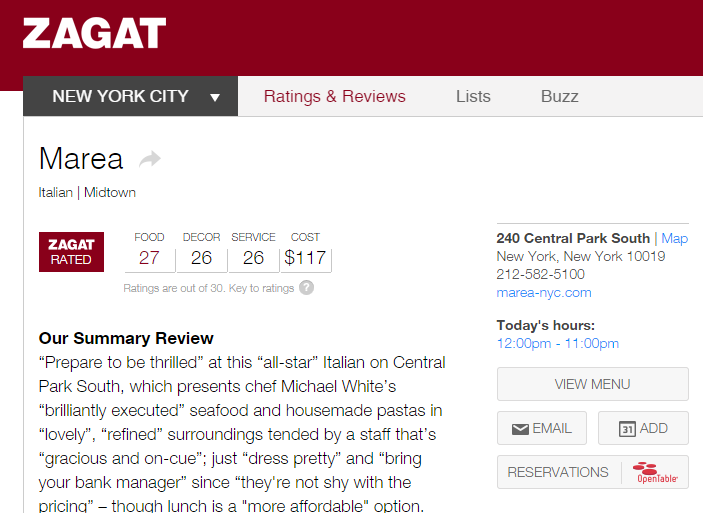

```{r setup, include=FALSE}
library(knitr)
options(digits=3)
knitr::opts_chunk$set(echo = TRUE, fig.align = "center", message = FALSE)
library(tidyverse)
library(oilabs)
library(openintro)
```


# Ex: Restaurants in NYC
--

```{r out.width=650, echo = FALSE}

```


---
class:small
# Ex: Restaurants in NYC 
--

```{r echo = FALSE}
nyc <- read_csv("../data/nyc.csv")
```

```{r}
nyc
```

What is the unit of observation?

--

*A restaurant*

---
# What determines the price of a meal?
--

Let's look at the relationship between price, food rating, and decor rating.

$$Price \sim Food + Decor$$

--

```{r}
m1 <- lm(Price ~ Food + Decor, data = nyc)
```


---
class: small
# Model 1: Food + Decor
--

```{r}
summary(m1)
```

---
# The geometry of regression models 

The function for $\hat{y}$ is . . .

--

- A *line* when you have one continuous $x$.

--

- *Parallel lines* when you have one continuous $x_1$ and one categorical $x_2$.

--

- *Unrelated lines* when you have one continuous $x_1$, one categorical $x_2$, 
and an interaction term $x_1 : x_2$.

--

When you have two continuous predictors $x_1$, $x_2$, then your mean function
is . . .

--

*a plane*


---
# 3d plot

interactive code

```{r echo=FALSE, eval=FALSE}
library(rgl)
plot3d(x = nyc$Food, y = nyc$Decor, z = nyc$Price, col = "steelblue", 
       xlab = "Food rating", ylab = "Decor Rating", zlab = "Price")
m1 <- lm(Price ~ Food + Decor, data = nyc)
coefs <- m1$coef
planes3d(coefs["Food"], coefs["Decor"], -1, coefs["(Intercept)"],
         alpha = 0.4, col = "lightgray")
```


---
# Location, location, location
--

Does the price depend on where the restaurant is located in Manhattan?

$$Price \sim Food + Decor + East$$
--

.tiny[
```{r}
nyc
```
]

---
class: small
# Model 2: Food + Decor + East
--

```{r}
m2 <- lm(Price ~ Food + Decor + East, data = nyc)
summary(m2)
```


---
# The geometry of regression models 
--

- When you have two continuous predictors $x_1$, $x_2$, then your mean function
is *a plane*.

--

- When you have two continuous predictors $x_1$, $x_2$, and a categorical 
predictor $x_3$, then your mean function represents *parallel planes*.


---
# 3d Plot
--

interactive code

```{r echo = FALSE, eval = FALSE}
m2 <- lm(Price ~ Food + Decor + East, data = nyc)
colvec <- rep("steelblue", dim(nyc)[1])
colvec[nyc$East == 1] <- "orange"
plot3d(x = nyc$Food, y = nyc$Decor, z = nyc$Price, col = colvec, 
       xlab = "Food rating", ylab = "Decor Rating", zlab = "Price")
coefs <- m2$coef
planes3d(coefs["Food"], coefs["Decor"], -1, coefs["(Intercept)"],
         alpha = 0.4, col = "steelblue")
planes3d(coefs["Food"], coefs["Decor"], -1, coefs["(Intercept)"] + coefs["East"],
         alpha = 0.4, col = "orange")
```


---
# The geometry of regression models 
--

- When you have two continuous predictors $x_1$, $x_2$, then your mean function
is *a plane*.

--

- When you have two continuous predictors $x_1$, $x_2$, and a categorical 
predictor $x_3$, then your mean function represents *parallel planes*.

--

- When you add in interaction effects, the planes become *tilted*.


---
class: small
# Model 3: Food + Decor + East + Decor:East
--

```{r}
m3 <- lm(Price ~ Food + Decor + East + Decor:East, data = nyc)
summary(m3)
```


---
# 3d plot
--

interactive code

```{r echo=FALSE, eval=FALSE}
colvec <- rep("steelblue", dim(nyc)[1])
colvec[nyc$East == 1] <- "orange"
plot3d(x = nyc$Food, y = nyc$Decor, z = nyc$Price, col = colvec, 
       xlab = "Food rating", ylab = "Decor Rating", zlab = "Price")
coefs <- m3$coef
planes3d(coefs["Food"], coefs["Decor"], -1, coefs["(Intercept)"],
         alpha = 0.4, col = "steelblue")
planes3d(coefs["Food"], coefs["Decor"] + coefs["Decor:East"], -1, 
         coefs["(Intercept)"] + coefs["East"], alpha = 0.4, col = "orange")
```


---
# Comparing Models
--

- The `East` term was significant in model 2, suggesting that there is a 
significant relationship between location and price.

--

- That term became nonsignificant when we allowed the slope of `Decor` to vary
with location, and that difference in slopes was also nonsignificant.

--

- Notice that slope estimate for a given variable will almost *always* change 
depending on the other variables that are in the model.
