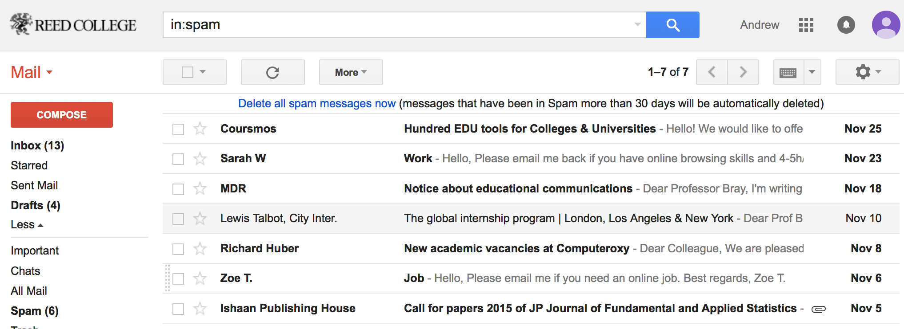

```{r setup, include=FALSE}
library(knitr)
options(digits=3)
knitr::opts_chunk$set(echo = TRUE, fig.align = "center")
library(dplyr)
library(ggplot2)
library(oilabs)
library(openintro)
```

# Building a spam filter
--

.tiny[
```{r}
head(email)
```
]

---
# How was the data collected?
--

```{r out.width=800, echo = FALSE}

```

--

1. Choose a single email account
2. Save each email that comes in during a given time frame
3. Create dummy variables for each text component of interest
4. Visually classify each as spam or not


---
# Simple Filter A 
--

Predicting spam or not using the presence of "winner".

--

```{r echo = FALSE, fig.width=7, fig.height = 5}
email <- mutate(email, spam = factor(spam))
ggplot(email, aes(x = winner, fill = spam)) +
  geom_bar(position ="fill") +
  theme_bw(base_size = 18)
```

If "winner" then "spam"?

---
# Simple Filter B 
--

Predicting spam or not using number of characters (in K)

```{r echo = FALSE, fig.width = 8, fig.height = 5}
ggplot(email, aes(x = num_char, fill = spam)) +
  geom_density(alpha = .4) +
  theme_bw(base_size = 18)
```


---
# Simple Filter B, cont.

Predicting spam or not using log number of characters (in K)

--

```{r echo = FALSE, fig.width = 8, fig.height = 5}
ggplot(email, aes(x = log(num_char), fill = spam)) +
  geom_density(alpha = .4) +
  theme_bw(base_size = 18)
```

If `log(num_char)` < 1, then "spam"?

---
# Challenges 
--

Each simple filter can be thought of as a regression model.

## Filter A

$spam \sim winner; \quad X_1 \sim X_2$

## Filter B
$spam \sim log(num\_char); \quad X_1 \sim W_1$

Each one by itself has poor predictive power, so how can we combine them into
a single stronger model?


---

```{r out.width=800, echo = FALSE}
knitr::include_graphics("figs/good-bad.jpg")
```

cartoons + boardwork

---
# Logistic Regression for B
--

$$spam \sim log(num\_char)$$

```{r echo = FALSE, eval = TRUE, message = FALSE, fig.width=8, fig.height = 5}
email <- email %>%
  mutate(spam = as.numeric(spam) - 1,
         log_num_char = log(num_char))
ggplot(email, aes(x = log_num_char, y = spam)) +
  geom_point(alpha = .05, size = 3) + 
  stat_smooth(method = "glm", 
              method.args = list(family = "binomial"), 
              se = FALSE,
              col = "steelblue") +
  theme_bw(base_size = 18)
```


---
# Model fitting
--

.tiny[
```{r}
m1 <- glm(spam ~ log_num_char, data = email, family = "binomial")
summary(m1)
```
]

---
# Interpreting Log. Reg.
--

1. Each row of the summary output is still a H-test on that parameter being 0.

--

2. A positive slope estimate indicates that there is a positive association.

--

3. Each estimate is still conditional on the other variables held constant.


---
# A more sophisticated model
--

.tiny[
```{r}
m2 <- glm(spam ~ log_num_char + to_multiple + 
            attach + dollar + inherit + viagra, 
          data = email,
          family = "binomial")
summary(m2)
```
]

---
# Comparing models: confusion matrix 
--

```{r, echo = FALSE}
make_conf_mat <- function(model, test){
  y <- test %>% 
    mutate(prob = predict(model, newdata = test, type = "response"))
  
  if (is.factor(y$prob)){
    y <- y %>% 
      mutate(pred = prob) %>% 
      group_by(spam, pred) %>%
      tally()
  } else {
    y <- y %>% 
      mutate(pred = prob > .5) %>% 
      group_by(spam, pred) %>%
      tally()
  }
    
  y
}

misclass <- function(conf_mat){
  if(nrow(conf_mat) == 4){
    num_misclass <- conf_mat %>% 
      ungroup() %>% 
      filter((spam == 1 & pred == 0) | (spam == 0 & pred == 1)) %>%
      summarise(n = sum(n)) %>% 
      mutate(n = n/nrow(test_data))
  } else if(nrow(conf_mat) == 2){
    num_misclass <- conf_mat %>% 
      ungroup() %>% 
      filter(spam == 0) %>% 
      select(n) %>% 
      mutate(n = n/nrow(test_data))
  } else return(NA)
  
  return(num_misclass[[1,1]])
}
```

.tiny[
```{r}
make_conf_mat(m1, email)
```
]

--

.tiny[
```{r}
make_conf_mat(m2, email)
```
]
---
# Test-train
--

In the test-train paradigm, you balance descriptive power with predictive accuracy by separating your data set into:

1. **Training set**: used to fit your model
2. **Testing set**: used to evaluate predictive accuracy

Related to cross-validation...


---
# Dividing the data
--

.tiny[
```{r}
set.seed(501)
train_indices <- sample(1:nrow(email), 
                        size = floor(nrow(email)/2))
head(train_indices)
```
]

--

.tiny[
```{r}
train_data <- email %>%
  slice(train_indices)
test_data <- email %>%
  slice(-train_indices)
```
]

--

.tiny[
```{r}
dim(train_data)
dim(test_data)
```
]

---
# Training
--

.tiny[
```{r}
m1 <- glm(spam ~ log_num_char, 
          data = train_data, 
          family = "binomial")
m2 <- glm(spam ~ log_num_char + to_multiple +
            attach + dollar + inherit + viagra, 
          data = train_data, 
          family = "binomial")
```
]

---
# Testing
--

.tiny[
```{r}
make_conf_mat(m1, test_data)
```
]

--

.tiny[
```{r}
make_conf_mat(m2, test_data)
```
]

---
# Extending the model 
--

A GLM consists of three things:

1. A linear predictor
2. A distribution of the response
3. A link function between the two

--

**MLR**: Normal distribution, identity link function

--

**Logisitic Regression**: Binomial distribution, logit link function

--

**Poisson Regression**: Poisson distribution, logarithm
