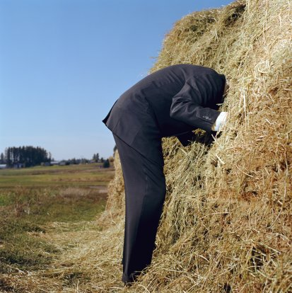

```{r setup, include=FALSE}
library(knitr)
options(digits=3)
knitr::opts_chunk$set(echo = TRUE, fig.align = "center")
library(dplyr)
library(ggplot2)
library(oilabs)
library(openintro)
```


# The Problem of Model Selection

.pull-left[
```{r out.width=350, out.height=450, echo = FALSE}

```
]

.pull-right[
A given data set can conceivably have been generated from uncountably
many models.  Identifying the true model is like finding a piece of hay in a 
haystack. Said another way, the model space is massive and the criterion for
what constitutes the "best" model is ill-defined.
]


---
# The Problem of Model Selection
--

**Best strategy**: Use domain knowledge to constrain the model space and/or
build models that help you answer specific scientific questions.

--

**Another common strategy:**

1. Pick a criterion for "best".

--

2. Decide how to explore the model space.

--

3. Select "best" model in search area.

--

**Tread Carefully!!!**  The second strategy can lead to myopic analysis, 
overconfidence, and wrong-headed conclusions.


---
# What do we mean by "best"?
--

While we'd like to find the "true" model, in practice we just hope we're doing
a good job at:

1. Prediction
2. Description

---
# Synthetic example
--

How smooth should our model be?

```{r, echo=FALSE, fig.align='center', fig.width=8, fig.height=6}
betas <- c(0, 1, 1, -4, 1)
sigma <- 5
n <- 40
set.seed(110)
x <- runif(n, 0, 5)
EyGx <- betas[1] + betas[2]*x + betas[3]*x^2 + betas[4]*x^3 + betas[5]*x^4
y <- EyGx + rnorm(n, 0, sigma)
p0 <- data.frame(x, y) %>%
  ggplot(aes(x = x, y = y)) +
  geom_point(size = 4, col = "steelblue") +
  theme_bw(base_size = 18)
p0
```

---
# Four candidates
--

```{r}
m1 <- lm(y ~ x)
m2 <- lm(y ~ x + I(x^2))
m3 <- lm(y ~ x + I(x^2) + I(x^3))
m4 <- lm(y ~ x + I(x^2) + I(x^3) + I(x^4))
```

We can add *polynomial* terms to account for non-linear trends.

---
# Four candidates
--

```{r echo = FALSE}
p1 <- p0 +
  geom_smooth(method = "lm", formula = y ~ x, 
              se = FALSE, col = "goldenrod")
p2 <- p0 +
  geom_smooth(method = "lm", formula = y ~ x + I(x^2),
              se = FALSE, col = "goldenrod")
p3 <- p0 +
  geom_smooth(method = "lm", formula = y ~ x + I(x^2) + I(x^3), 
              se = FALSE, col = "goldenrod")
p4 <- p0 +
  geom_smooth(method = "lm", formula = y ~ x + I(x^2) + I(x^3) + I(x^4),
              se = FALSE, col = "goldenrod")
```

```{r, echo = FALSE, fig.align='center', fig.width=10.5, fig.height=6.7}
library(patchwork)
wrap_plots(p1, p2, p3, p4)
```


---
# $R^2$
--

One way to quantify the explanatory power of a model.

$$R^2 = 1 - \frac{SS_{res}}{SS_{tot}}$$

This captures the proportion of variability in the $y$ explained by our 
regression model.

---
# Comparing $R^2$
--

```{r}
c(summary(m1)$r.squared,
  summary(m2)$r.squared,
  summary(m3)$r.squared,
  summary(m4)$r.squared)
```

The observed data is best explained by the quartic model.  So
that's the best model, right?

---
# The BEST model!
--

```{r, echo=FALSE, fig.align='center', fig.width=8, fig.height=6}
p20 <- p0 +
  geom_smooth(method = "lm", formula = y ~ poly(x, 20),
              se = FALSE, col = "goldenrod")
p20
```

---
# The BEST model!
--

```{r}
mBEST <- lm(y ~ poly(x, 20))
c(summary(m1)$r.squared,
  summary(m2)$r.squared,
  summary(m3)$r.squared,
  summary(m4)$r.squared,
  summary(mBEST)$r.squared)
```

But surely that's not the best model...

---
# Three Criteria
--

1. $R^2$
2. $R^2_{adj}$
3. p-values

There are many others ( $AIC$, $BIC$, $AIC_C$, ...).

---
# $R^2_{adj}$
--

A measure of explanatory power of model:

$$R^2 = 1 - \frac{SS_{res}}{SS_{tot}}$$

--

But it only goes up with added predictors, therefore we add a
penalty.

$$R^2_{adj} = 1 - \frac{SS_{res}/(n - (p + 1))}{SS_{tot}/(n - 1)}$$

---
# $R^2$ vs. $R^2_{adj}$
--

```{r}
summary(mBEST)$r.squared
summary(mBEST)$adj.r.squared
```


---
# The Signal and the Noise
--

live coding

```{r, echo = FALSE, eval = FALSE}
set.seed(213)
poverty <- read.delim("../data/poverty.txt", header = TRUE)
m1 <- lm(Poverty ~ Graduates, data = poverty)
summary(m1)
poverty$Noise <- rnorm(nrow(poverty))
m2 <- lm(Poverty ~ Graduates + Noise, data = poverty)
summary(m2)
```

