```{r setup, include=FALSE}
library(knitr)
options(digits=3)
knitr::opts_chunk$set(echo = TRUE, fig.align = "center", warning = FALSE, message = FALSE)
library(dplyr)
library(ggplot2)
library(patchwork)
```

Please draw your own subjective distributions for the following events/items.

1. The probability that it will snow at Reed this winter.
2. The probability that, on a given night, the sun has gone supernova.
3. The total number of individual socks that you own.


---
# Karl Broman's Socks
--

```{r echo = FALSE, eval = FALSE}
# credit for this example goes to Rasmus Baathe, who made a similar presentation
# at userR! 2015. most of the included images are his.
```


```{r out.width=370, echo = FALSE}
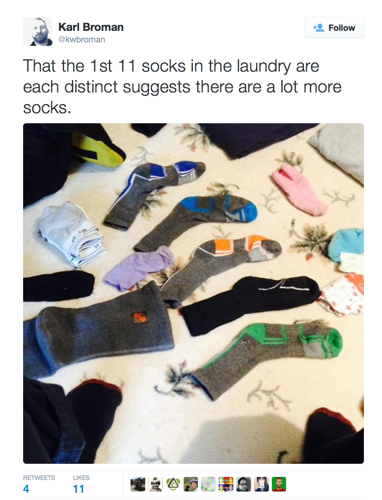
```


---
class:small
# Classical H test 
--

## Assert a model
$H_0$: I have $N_{pairs}$ pairs of socks and $N_{singles}$ singletons. The first 11 socks that I pull out of the machine are a random sample from this population.

--

## Decide on a test statistic
The number of singletons in the sample: 11.

--

## Construct the sampling distribution
Probability theory or simulation.

--

## See where your observed stat lies in that distribution
Find the p-value if you like.


---
# $H_0$
--

```{r out.width=220, echo = FALSE}
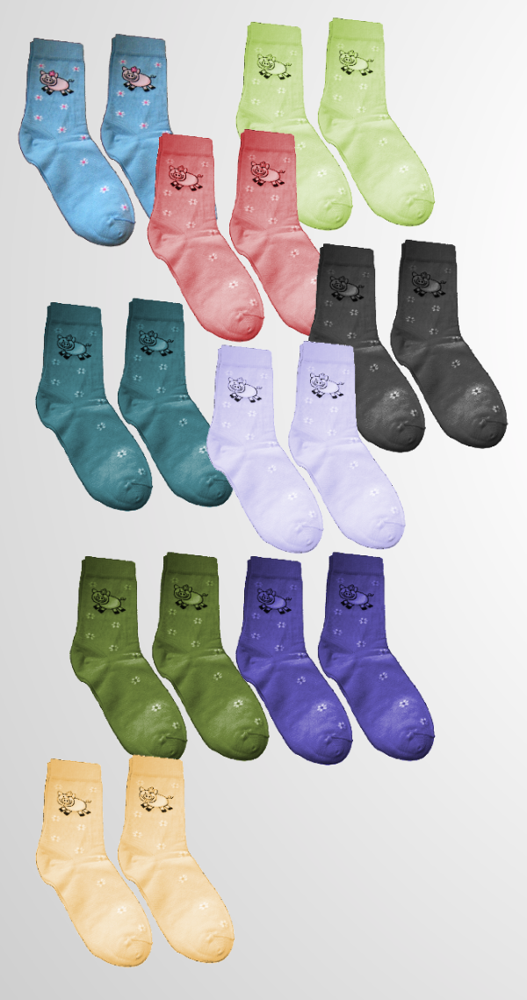
```

$$N_{pairs} = 9$$


---
# $H_0$

```{r out.width=400, echo = FALSE}
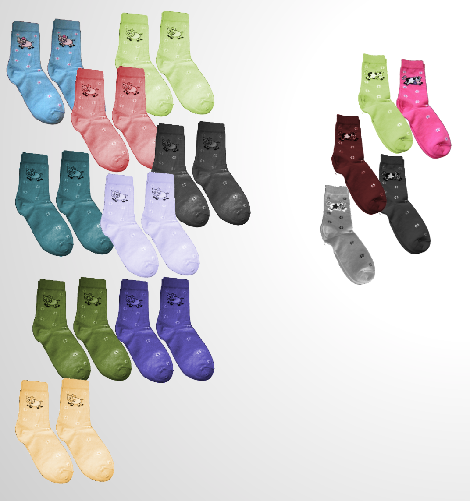
```

$$N_{pairs} = 9; \quad N_{singles} = 5$$


---
# Contructing the sampling dist. 
--

We'll use simulation.

--

Create the population of socks:


```{r}
sock_pairs <- c("A", "B", "C", "D", "E", 
                "F", "G", "H", "I", "J", "K")
sock_singles <- c("l", "m", "n", "o", "p")
socks <- c(rep(sock_pairs, 
               each = 2), 
           sock_singles)
```

--

```{r}
socks
```


---
# One draw from the machine 
--

.tiny[
```{r}
picked_socks <- sample(socks, size = 11, replace = FALSE)
picked_socks
```
]

--

.tiny[
```{r}
sock_counts <- table(picked_socks)
sock_counts
```
]

--

.tiny[
```{r}
n_singles <- sum(sock_counts == 1)
n_singles
```
]


---
# Our simulator
--

```{r out.width=310, echo = FALSE}

```


---
# Constructing the sampling dist. 
--

```{r echo = FALSE}
pick_socks <- function(N_pairs, N_singles, N_pick) {
  N_sock_types <- N_pairs + N_singles
  socks <- rep(1:N_sock_types, rep( 2:1, c(N_pairs, N_singles) ))
  picked_socks <- sample(socks, 11)
  sock_counts <- table(picked_socks)
  n_singles <- sum(sock_counts == 1)
  n_singles
}
set.seed(200)
```

```{r}
pick_socks(N_pairs = 9,N_singles = 5,
           N_pick = 11)
```

--

```{r}
pick_socks(9, 5, 11)
```

--

```{r}
pick_socks(9, 5, 11)
```

Repeat many, many times...


---
# The sampling distribution
--

```{r echo = FALSE, cache = TRUE, fig.height = 6.5}
set.seed(301)
sim_singles <- rep(0, 1000)

for (i in 1:1000) {
  sim_singles[i] <- pick_socks(9, 5, 11)
}

ggplot(data.frame(sim_singles), aes(x = as.factor(sim_singles))) +
  geom_bar() +
  labs(x = "number of singletons") +
  theme_bw(base_size = 18)
```


---
# The sampling distribution

```{r echo = FALSE, fig.height = 6.5}
ggplot(data.frame(sim_singles), aes(x = as.factor(sim_singles))) +
  geom_bar() +
  labs(x = "number of singletons") +
  theme_bw(base_size = 18) +
  geom_vline(xintercept = 6, col = "tomato", lwd = 2)
```


---
# The p-value 
--

Quantifying how far into the tails our observed count was.

```{r}
table(sim_singles)
```

--

```{r}
table(sim_singles)[6]/1000
```

--

```{r echo = FALSE}
pval <- table(sim_singles)[6]/1000
```

Our two-tailed p-value is `r pval*2`.


---
# Question
--

What is the best definition for our one-tailed p-value in probability notation?

1. P( $H_0$ is true | data) = `r pval`
2. P( $H_0$ is false | data) = `r pval`
3. P( $H_0$ is true) = `r pval`
4. P( data | $H_0$ is true) = `r pval`
5. P( data) = `r pval`


---
# Question

What is the best definition for our one-tailed p-value in probability notation?

1. P( $H_0$ is true | data) = `r pval`
2. P( $H_0$ is false | data) = `r pval`
3. P( $H_0$ is true) = `r pval`
4. **P( data | $H_0$ is true) = `r pval`**
5. P( data) = `r pval`


---
# The challenge with the classical method
--

The result of a hypothesis test is a probability of the form:

$$ P(\textrm{ data or more extreme } | \ H_0 \textrm{ true }) $$

while most people *think* they're getting

$$ P(\ H_0 \textrm{ true } | \textrm{ data }) $$

How can we go from the former to the latter?


---
# What we have
--

```{r out.width=800, echo = FALSE}
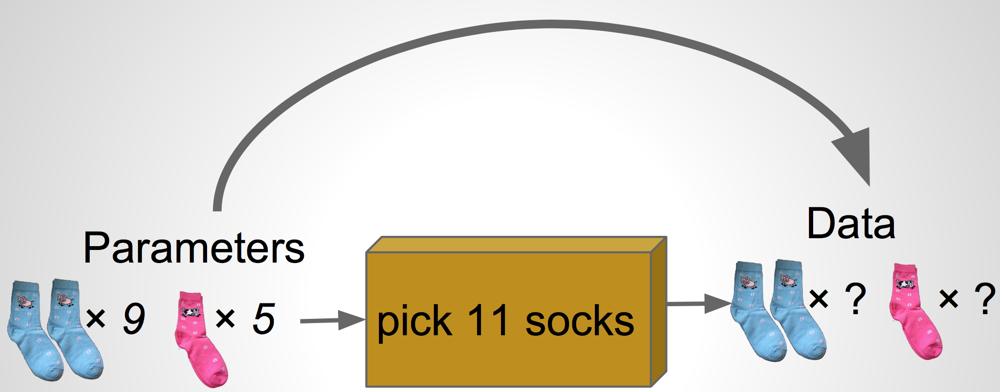
```


---
# What we want
--

```{r out.width=800, echo = FALSE}
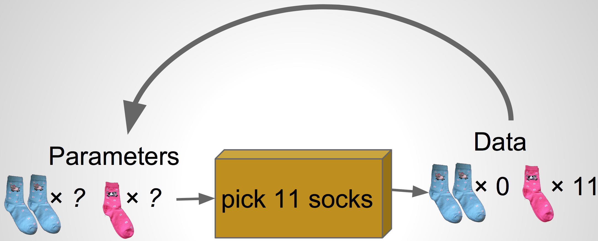
```


---
# Bayesian modeling via Bayes' rule 
--

$$P(A \ | \ B) = \frac{P(A \textrm{ and } B)}{P(B)} $$

$$P(A \ | \ B) = \frac{P(B \ | \ A) \ P(A)}{P(B)} $$

$$P(model \ | \ data) = \frac{P(data \ | \ model) \ P(model)}{P(data)} $$

What does it mean to think about $P(model)$?


---

Please draw your own subjective distributions for the following events/items.

1. The probability that it will snow at Reed this winter.
2. The probability that, on a given night, the sun has gone supernova.
3. The total number of individual socks that you own.


---
# Prior distribution
--

A *prior distribution* is a probability distribution for a *parameter* that 
summarizes the information that you have before seeing the data. Prior on $N$:

--

```{r, cache = TRUE, echo = FALSE, fig.height=5}
x <- rnbinom(1e6, mu = 30, size = -30^2 / (30 - 15^2))
prior_n <- ggplot(data.frame(x), aes(x = x)) +
  geom_histogram(binwidth = 2, fill = "green", col = "black") +
  labs(x = "number of socks",
       y = "density",
       title = "P(parameter)") +
  lims(x = c(0, 100)) +
  theme(axis.text.y = element_blank(),
        axis.ticks.y = element_blank()) +
  theme_bw(base_size = 18)
prior_n
```


---
# Prior on proportion pairs
--

```{r cache = TRUE, echo = FALSE, fig.height=6}
y <- rbeta(1e6, shape1 = 15, shape2 = 2)
prior_p <- ggplot(data.frame(y), aes(x = y)) +
  geom_histogram(binwidth = .02, fill = "green", col = "black") +
  labs(x = "proportion of pairs",
       y = "density",
       title = "P(parameter)") +
  lims(x = c(0, 1)) +
  theme_bw(base_size = 18)
prior_p
```


---
# Our scheme
--

```{r out.width=550, echo = FALSE}
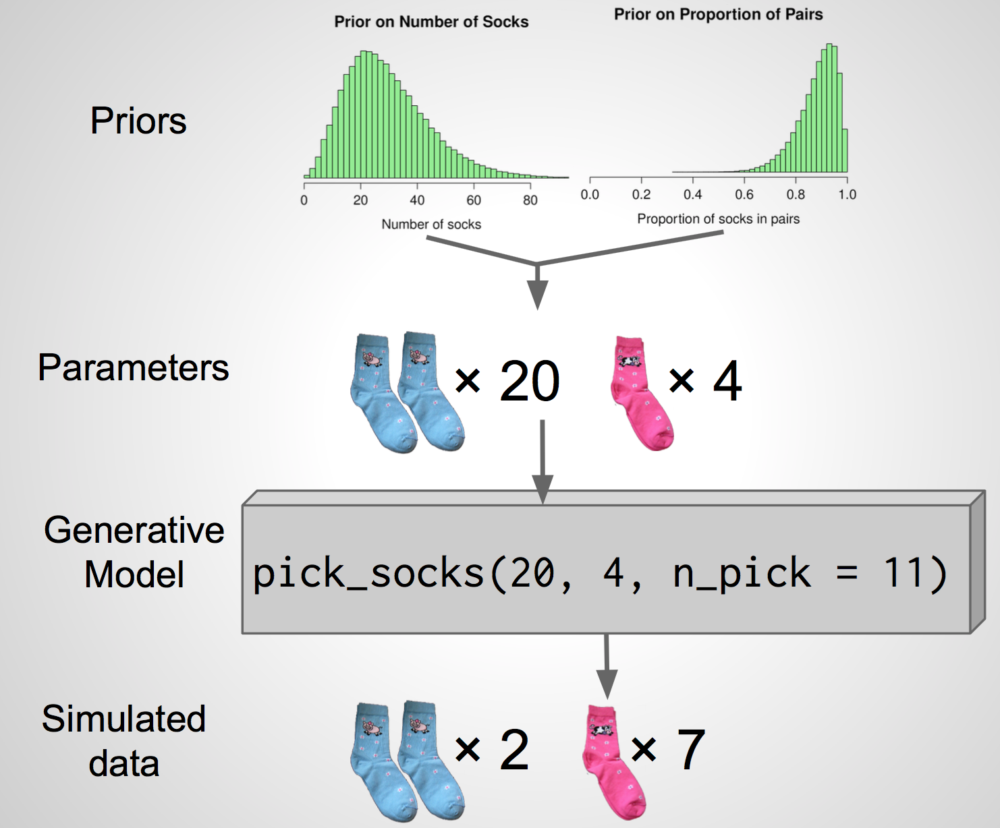
```


---
# One simulation
--

```{r out.width=620, echo = FALSE}
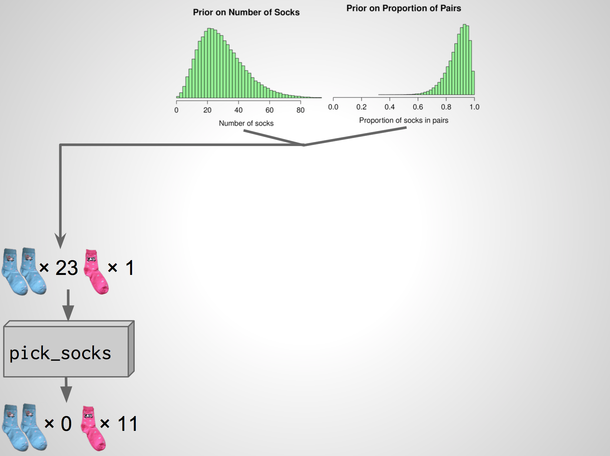
```

---
# A second simulation

```{r out.width=620, echo = FALSE}
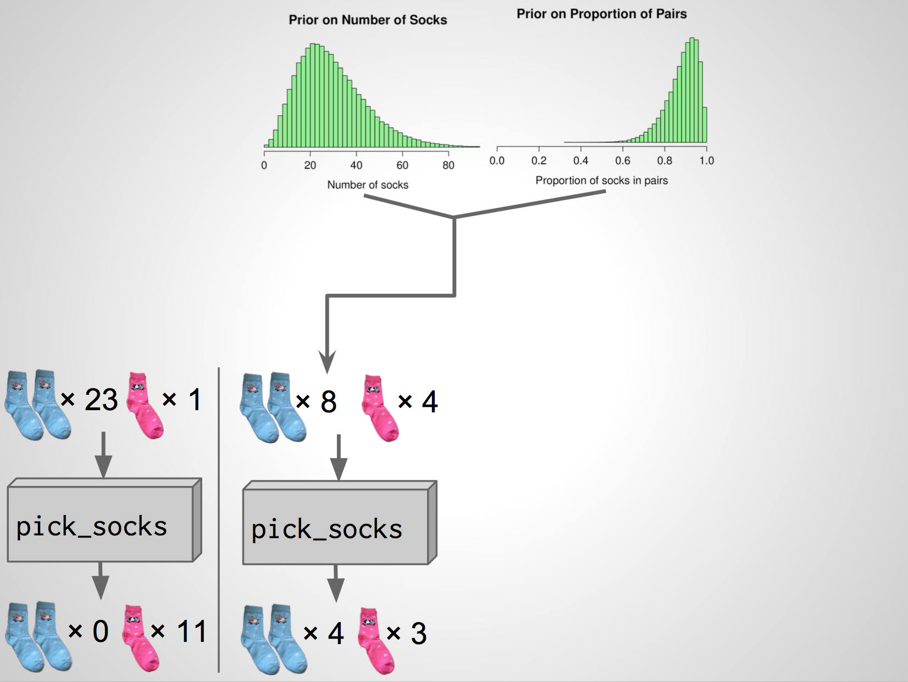
```

---
# A third simulation

```{r out.width=620, echo = FALSE}
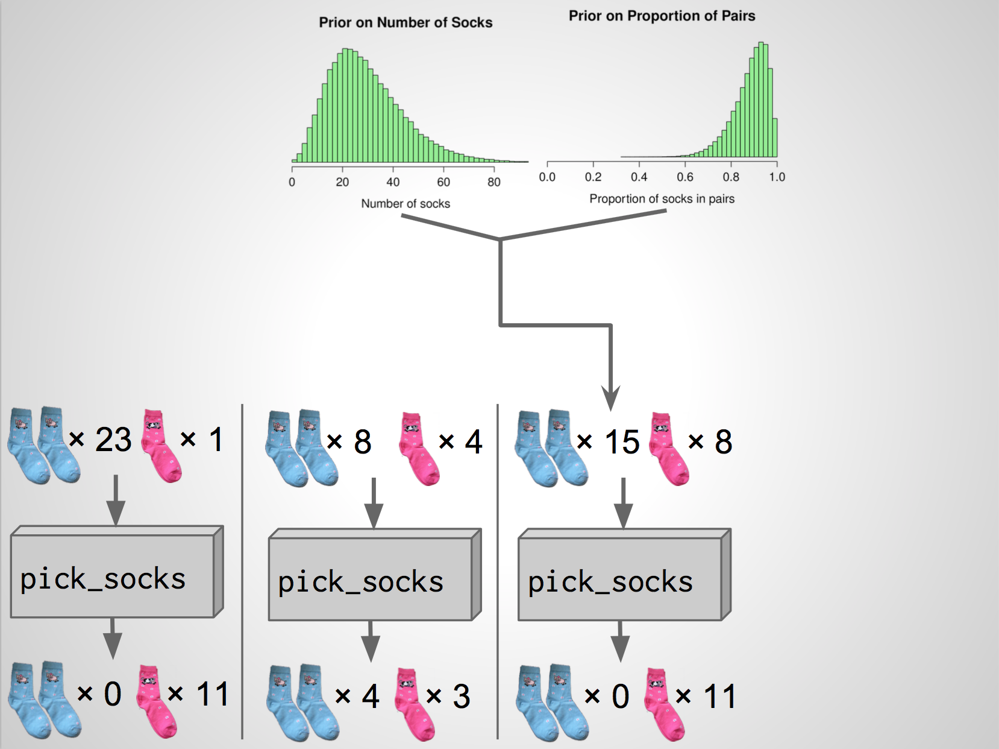
```

---
# A fourth simulation

```{r out.width=620, echo = FALSE}
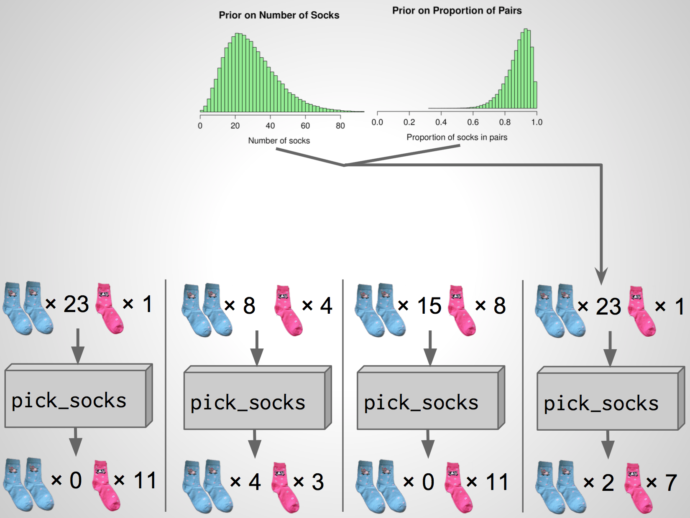
```

---
# The actual data

```{r out.width=620, echo = FALSE}
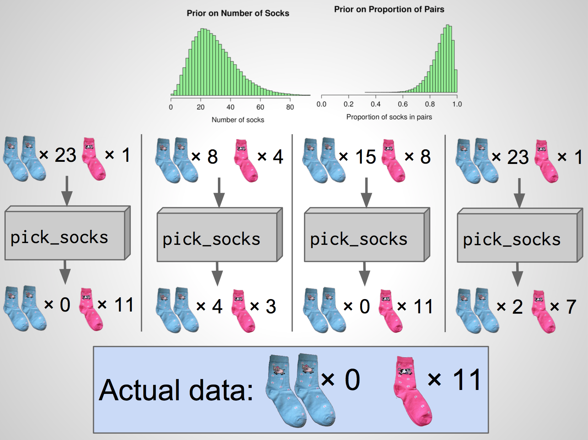
```

---
# The actual data

```{r out.width=620, echo = FALSE}
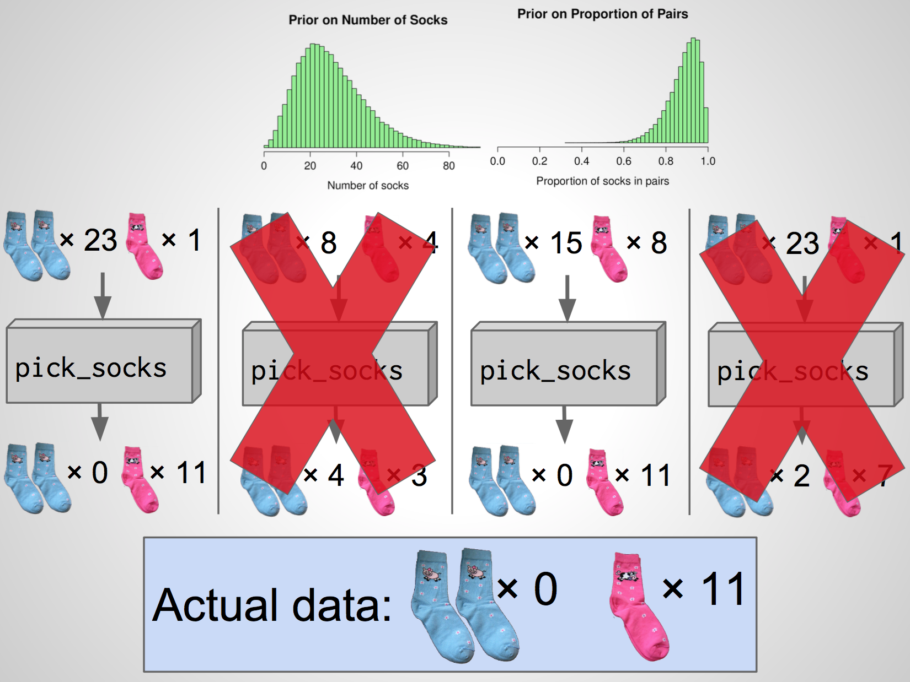
```

---
class:small
# Full simulation 
--

```{r cache = TRUE, echo = FALSE}
sock_sim <- t(replicate(100000, {
  n_socks <- rnbinom(1, mu = 30, size = -30^2 / (30 - 15^2) )
  prop_pairs <- rbeta(1, shape1 = 15, shape2 = 2)
  n_pairs <- round(floor(n_socks / 2) * prop_pairs)
  n_odd <- n_socks - n_pairs * 2
  n_sock_types <- n_pairs + n_odd
  socks <- rep(seq_len(n_sock_types), rep( 2:1, c(n_pairs, n_odd) ))
  picked_socks <- sample(socks, size =  min(11, n_socks))
  sock_counts <- table(picked_socks)
  c(singletons = sum(sock_counts == 1), 
    pairs = sum(sock_counts == 2),
    n_socks = n_socks, 
    prop_pairs = prop_pairs)
}))
sock_sim <- as.data.frame(sock_sim)
post_samples <- sock_sim %>%
  filter(singletons == 11, pairs == 0)
```

```{r}
head(sock_sim)
```

--

```{r fullsim, eval = FALSE}
sock_sim %>%
  filter(singletons == 11, pairs == 0) %>%
  head()
```

--

```{r reef.label = "fullsim", echo = FALSE}
sock_sim %>%
  filter(singletons == 11, pairs == 0) %>%
  head()
```


---
# Proportion of pairs
--

```{r cache = TRUE, echo = FALSE, fig.width = 10, fig.height = 6.5}
post_p <- ggplot(post_samples, aes(x = prop_pairs)) +
  geom_histogram(binwidth = .02, fill = "green", col = "black") +
  labs(x = "proportion of pairs",
       y = "density",
       title = "P(parameter|data)") +
  lims(x = c(0, 1)) +
  theme_bw(base_size = 18)
prior_p + post_p
```


---
# Number of socks
--

```{r cache = TRUE, echo = FALSE, fig.width = 10, fig.height = 6.5}
post_n <- ggplot(post_samples, aes(x = n_socks)) +
  geom_histogram(binwidth = 2, fill = "green", col = "black") +
  labs(x = "number of socks",
       y = "density",
       title = "P(parameter|data)") +
  lims(x = c(0, 100)) +
  theme_bw(base_size = 18)
prior_n + post_n
```


---
# Karl Broman's Socks
--

```{r out.width=370, echo = FALSE}

```


---
# The posterior distribution 
--

```{r cache = TRUE, echo = FALSE, fig.height = 3, fig.width = 5.5}
post_n
```

--

- Distribution of a parameter after conditioning on the data
- Synthesis of prior knowledge and observations (data)

--

## Question
What is your best guess for the number of socks that Karl has?


---
# Our best guess
--

```{r cache = TRUE, echo = FALSE, fig.height = 3, fig.width = 5.5}
post_n +
  geom_vline(xintercept = median(post_samples$n_socks), 
             col = "goldenrod",
             lwd = 2)
```

- The posterior median is 44 socks.


---
# Karl Broman's Socks
--

```{r out.width=600, echo = FALSE}
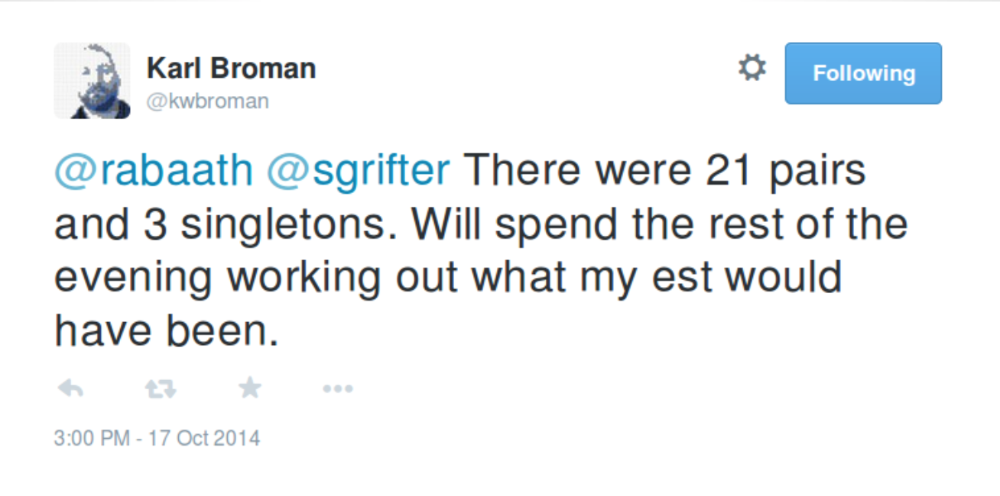
```

--

$$ 21 \times 2 + 3 = 45 \textrm{ socks} $$


---
# Summary
--

Bayesian methods . . .

--

- Require the subjective specification of your prior knowledge

--

- Provide a posterior distribution on the parameters

--

- Are usually computationally intensive

--

- Have strong intuition


---

```{r out.width=360, echo = FALSE}
knitr::include_graphics("figs/supernova.png")
```

